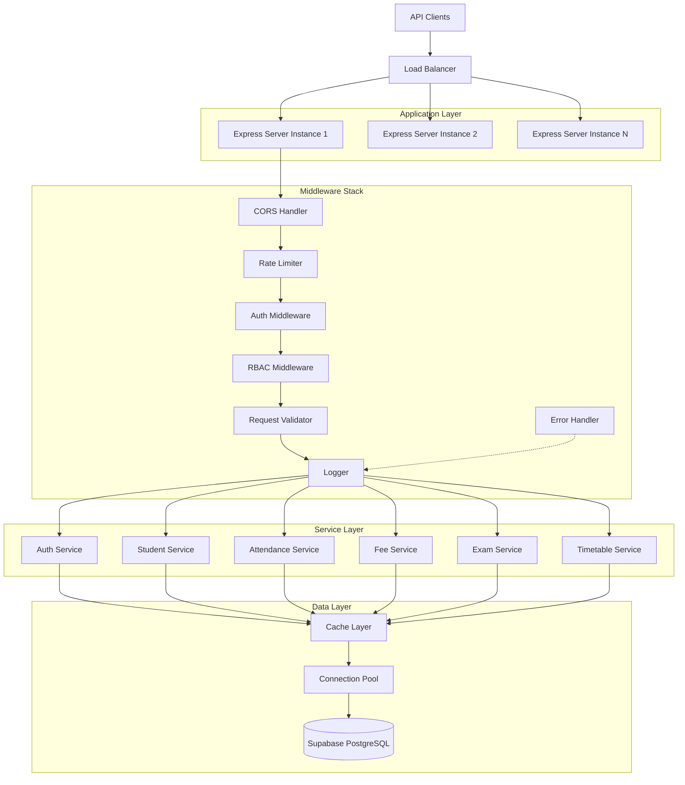
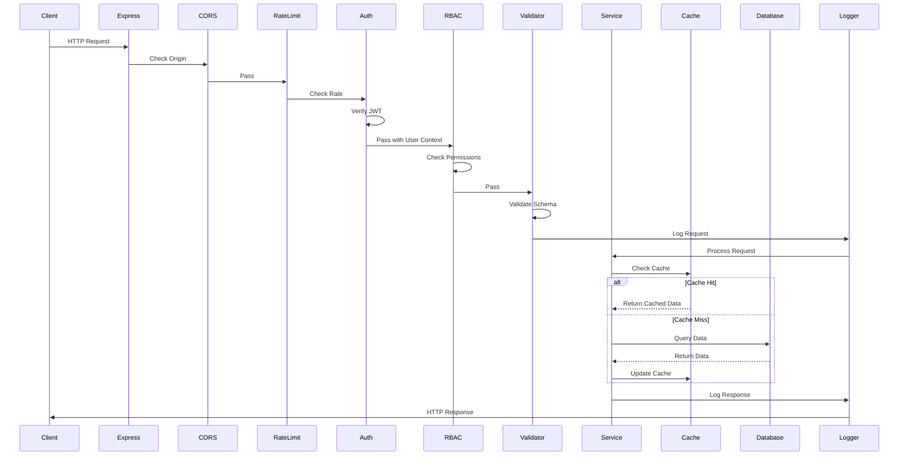
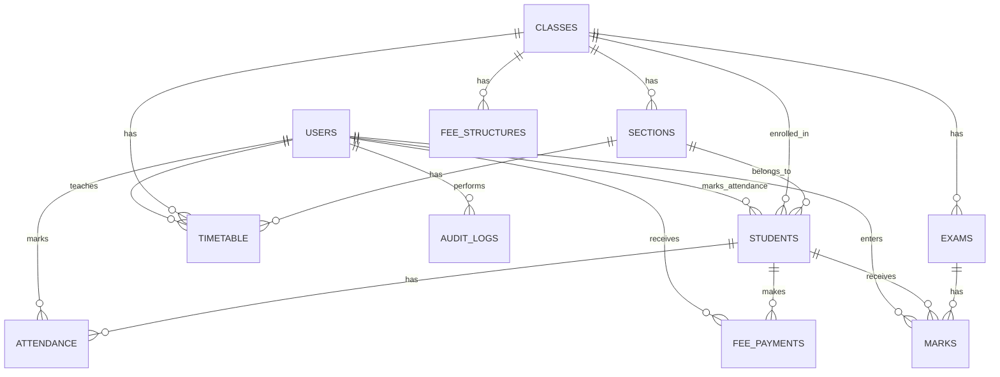
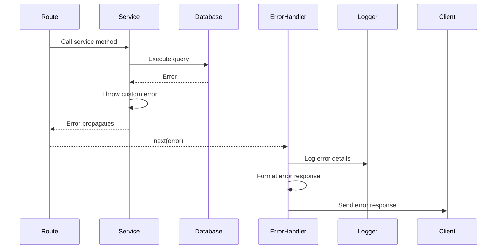

# Design Document: Enterprise Backend System

## Overview

The Enterprise Backend System is a production-ready Node.js + Express.js RESTful API server that provides comprehensive school management functionality. The system transforms an MVP backend into a scalable, secure, and maintainable platform following industry best practices.

### Core Objectives

- Provide secure authentication and role-based access control
- Implement comprehensive input validation and error handling
- Ensure high performance through caching and query optimization
- Maintain data integrity through transaction management
- Enable monitoring and observability through logging and health checks
- Support multiple deployment environments with configuration management

### Technology Stack

- **Runtime**: Node.js 18+ LTS
- **Framework**: Express.js 4.18+
- **Database**: Supabase (PostgreSQL 14+)
- **Authentication**: jsonwebtoken 9.0+, bcryptjs 2.4+
- **Validation**: joi 17.9+ or express-validator 7.0+
- **Rate Limiting**: express-rate-limit 6.8+
- **Logging**: winston 3.10+
- **Caching**: node-cache 5.1+
- **Documentation**: swagger-ui-express 5.0+, swagger-jsdoc 6.2+
- **Testing**: jest 29.6+, supertest 6.3+
- **Database Client**: @supabase/supabase-js 2.26+

## Architecture

### High-Level Architecture



### Request Flow Sequence



### Directory Structure

```
enterprise-backend-system/
├── src/
│   ├── config/
│   │   ├── index.js              # Configuration loader
│   │   ├── database.js           # Database configuration
│   │   ├── cache.js              # Cache configuration
│   │   └── logger.js             # Logger configuration
│   ├── middleware/
│   │   ├── auth.js               # JWT authentication
│   │   ├── rbac.js               # Role-based access control
│   │   ├── validator.js          # Request validation
│   │   ├── rateLimiter.js        # Rate limiting
│   │   ├── errorHandler.js       # Error handling
│   │   ├── requestLogger.js      # Request/response logging
│   │   └── cors.js               # CORS configuration
│   ├── services/
│   │   ├── auth.service.js       # Authentication logic
│   │   ├── student.service.js    # Student management
│   │   ├── attendance.service.js # Attendance tracking
│   │   ├── fee.service.js        # Fee management
│   │   ├── exam.service.js       # Exam and results
│   │   └── timetable.service.js  # Timetable management
│   ├── routes/
│   │   ├── index.js              # Route aggregator
│   │   ├── auth.routes.js        # Auth endpoints
│   │   ├── student.routes.js     # Student endpoints
│   │   ├── attendance.routes.js  # Attendance endpoints
│   │   ├── fee.routes.js         # Fee endpoints
│   │   ├── exam.routes.js        # Exam endpoints
│   │   ├── timetable.routes.js   # Timetable endpoints
│   │   └── health.routes.js      # Health check
│   ├── models/
│   │   ├── schemas.js            # Validation schemas
│   │   └── types.js              # TypeScript types (if using TS)
│   ├── utils/
│   │   ├── cache.js              # Cache utilities
│   │   ├── database.js           # Database utilities
│   │   ├── serializer.js         # Response serialization
│   │   ├── parser.js             # Request parsing
│   │   ├── audit.js              # Audit logging
│   │   └── errors.js             # Custom error classes
│   ├── docs/
│   │   └── swagger.js            # OpenAPI specification
│   ├── app.js                    # Express app setup
│   └── server.js                 # Server entry point
├── tests/
│   ├── unit/
│   │   ├── services/             # Service unit tests
│   │   ├── middleware/           # Middleware unit tests
│   │   └── utils/                # Utility unit tests
│   ├── integration/
│   │   ├── auth.test.js          # Auth API tests
│   │   ├── student.test.js       # Student API tests
│   │   ├── attendance.test.js    # Attendance API tests
│   │   ├── fee.test.js           # Fee API tests
│   │   ├── exam.test.js          # Exam API tests
│   │   └── timetable.test.js     # Timetable API tests
│   ├── property/
│   │   ├── serializer.property.test.js
│   │   ├── validator.property.test.js
│   │   └── cache.property.test.js
│   └── setup.js                  # Test configuration
├── logs/                         # Log files (gitignored)
├── .env.example                  # Environment template
├── .env                          # Environment variables (gitignored)
├── package.json
├── jest.config.js
└── README.md
```

## Components and Interfaces

### 1. Authentication Service

**Purpose**: Handle user authentication, JWT generation, and password management.

**Interface**:
```javascript
class AuthService {
  /**
   * Authenticate user with credentials
   * @param {string} email - User email
   * @param {string} password - Plain text password
   * @returns {Promise<{token: string, user: Object}>}
   * @throws {AuthenticationError} If credentials are invalid
   */
  async login(email, password)

  /**
   * Generate JWT token for user
   * @param {Object} user - User object with id and role
   * @returns {string} JWT token
   */
  generateToken(user)

  /**
   * Verify JWT token
   * @param {string} token - JWT token
   * @returns {Promise<Object>} Decoded token payload
   * @throws {TokenExpiredError} If token is expired
   * @throws {JsonWebTokenError} If token is invalid
   */
  async verifyToken(token)

  /**
   * Hash password using bcrypt
   * @param {string} password - Plain text password
   * @returns {Promise<string>} Hashed password
   */
  async hashPassword(password)

  /**
   * Compare password with hash
   * @param {string} password - Plain text password
   * @param {string} hash - Hashed password
   * @returns {Promise<boolean>} True if match
   */
  async comparePassword(password, hash)
}
```

### 2. Student Service

**Purpose**: Manage student records and related operations.

**Interface**:
```javascript
class StudentService {
  /**
   * Create new student
   * @param {Object} studentData - Student information
   * @returns {Promise<Object>} Created student
   * @throws {ValidationError} If data is invalid
   * @throws {DuplicateError} If admission_no exists
   */
  async createStudent(studentData)

  /**
   * Get student by ID
   * @param {number} studentId - Student ID
   * @returns {Promise<Object|null>} Student or null
   */
  async getStudentById(studentId)

  /**
   * Get paginated student list
   * @param {Object} filters - Filter criteria
   * @param {number} page - Page number (1-indexed)
   * @param {number} limit - Records per page
   * @returns {Promise<{data: Array, pagination: Object}>}
   */
  async getStudents(filters, page, limit)

  /**
   * Update student
   * @param {number} studentId - Student ID
   * @param {Object} updates - Fields to update
   * @returns {Promise<Object>} Updated student
   * @throws {NotFoundError} If student doesn't exist
   */
  async updateStudent(studentId, updates)

  /**
   * Delete student and related records
   * @param {number} studentId - Student ID
   * @returns {Promise<void>}
   * @throws {NotFoundError} If student doesn't exist
   */
  async deleteStudent(studentId)
}
```

### 3. Attendance Service

**Purpose**: Track and manage student attendance records.

**Interface**:
```javascript
class AttendanceService {
  /**
   * Mark attendance for students
   * @param {Array<Object>} attendanceRecords - Array of {student_id, date, status}
   * @returns {Promise<Array<Object>>} Created records
   */
  async markAttendance(attendanceRecords)

  /**
   * Get attendance for student
   * @param {number} studentId - Student ID
   * @param {Date} startDate - Start date
   * @param {Date} endDate - End date
   * @returns {Promise<Array<Object>>} Attendance records
   */
  async getStudentAttendance(studentId, startDate, endDate)

  /**
   * Get attendance statistics
   * @param {number} studentId - Student ID
   * @param {Date} startDate - Start date
   * @param {Date} endDate - End date
   * @returns {Promise<{total: number, present: number, absent: number, percentage: number}>}
   */
  async getAttendanceStats(studentId, startDate, endDate)

  /**
   * Get class attendance for date
   * @param {number} classId - Class ID
   * @param {number} sectionId - Section ID
   * @param {Date} date - Date
   * @returns {Promise<Array<Object>>} Attendance records with student info
   */
  async getClassAttendance(classId, sectionId, date)
}
```

### 4. Fee Service

**Purpose**: Manage fee structures, payments, and billing.

**Interface**:
```javascript
class FeeService {
  /**
   * Create fee structure
   * @param {Object} feeData - Fee structure data
   * @returns {Promise<Object>} Created fee structure
   */
  async createFeeStructure(feeData)

  /**
   * Get fee structure for class
   * @param {number} classId - Class ID
   * @param {string} academicYear - Academic year
   * @returns {Promise<Object|null>} Fee structure
   */
  async getFeeStructure(classId, academicYear)

  /**
   * Record fee payment
   * @param {Object} paymentData - Payment information
   * @returns {Promise<Object>} Payment record
   * @throws {ValidationError} If payment amount invalid
   */
  async recordPayment(paymentData)

  /**
   * Get student fee status
   * @param {number} studentId - Student ID
   * @param {string} academicYear - Academic year
   * @returns {Promise<{total: number, paid: number, pending: number, payments: Array}>}
   */
  async getStudentFeeStatus(studentId, academicYear)

  /**
   * Get pending fees report
   * @param {number} classId - Class ID (optional)
   * @param {number} sectionId - Section ID (optional)
   * @returns {Promise<Array<Object>>} Students with pending fees
   */
  async getPendingFeesReport(classId, sectionId)
}
```

### 5. Exam Service

**Purpose**: Manage exams, marks, and results.

**Interface**:
```javascript
class ExamService {
  /**
   * Create exam
   * @param {Object} examData - Exam information
   * @returns {Promise<Object>} Created exam
   */
  async createExam(examData)

  /**
   * Enter marks for students
   * @param {number} examId - Exam ID
   * @param {Array<Object>} marksData - Array of {student_id, marks_obtained}
   * @returns {Promise<Array<Object>>} Created marks records
   */
  async enterMarks(examId, marksData)

  /**
   * Update marks
   * @param {number} markId - Mark record ID
   * @param {number} marksObtained - Updated marks
   * @returns {Promise<Object>} Updated marks record
   */
  async updateMarks(markId, marksObtained)

  /**
   * Get student results
   * @param {number} studentId - Student ID
   * @param {string} examType - Exam type (optional)
   * @returns {Promise<Array<Object>>} Marks records with exam details
   */
  async getStudentResults(studentId, examType)

  /**
   * Get class results
   * @param {number} examId - Exam ID
   * @returns {Promise<Array<Object>>} All students' marks for exam
   */
  async getClassResults(examId)

  /**
   * Calculate result statistics
   * @param {number} examId - Exam ID
   * @returns {Promise<{average: number, highest: number, lowest: number, passRate: number}>}
   */
  async getExamStatistics(examId)
}
```

### 6. Timetable Service

**Purpose**: Manage class schedules and timetables.

**Interface**:
```javascript
class TimetableService {
  /**
   * Create timetable entry
   * @param {Object} timetableData - Timetable information
   * @returns {Promise<Object>} Created timetable entry
   */
  async createTimetableEntry(timetableData)

  /**
   * Get timetable for class
   * @param {number} classId - Class ID
   * @param {number} sectionId - Section ID
   * @param {string} dayOfWeek - Day of week
   * @returns {Promise<Array<Object>>} Timetable entries
   */
  async getClassTimetable(classId, sectionId, dayOfWeek)

  /**
   * Get teacher timetable
   * @param {number} teacherId - Teacher ID
   * @param {string} dayOfWeek - Day of week
   * @returns {Promise<Array<Object>>} Timetable entries
   */
  async getTeacherTimetable(teacherId, dayOfWeek)

  /**
   * Update timetable entry
   * @param {number} entryId - Timetable entry ID
   * @param {Object} updates - Fields to update
   * @returns {Promise<Object>} Updated entry
   */
  async updateTimetableEntry(entryId, updates)

  /**
   * Delete timetable entry
   * @param {number} entryId - Timetable entry ID
   * @returns {Promise<void>}
   */
  async deleteTimetableEntry(entryId)
}
```

### 7. Cache Layer

**Purpose**: Provide in-memory caching for frequently accessed data.

**Interface**:
```javascript
class CacheService {
  /**
   * Get value from cache
   * @param {string} key - Cache key
   * @returns {*|null} Cached value or null
   */
  get(key)

  /**
   * Set value in cache
   * @param {string} key - Cache key
   * @param {*} value - Value to cache
   * @param {number} ttl - Time to live in seconds
   * @returns {boolean} Success status
   */
  set(key, value, ttl)

  /**
   * Delete value from cache
   * @param {string} key - Cache key
   * @returns {number} Number of deleted entries
   */
  del(key)

  /**
   * Delete all keys matching pattern
   * @param {string} pattern - Key pattern (e.g., 'student:*')
   * @returns {number} Number of deleted entries
   */
  delPattern(pattern)

  /**
   * Clear all cache
   * @returns {void}
   */
  flush()
}
```

### 8. Audit Logger

**Purpose**: Record critical operations for compliance and auditing.

**Interface**:
```javascript
class AuditLogger {
  /**
   * Log audit event
   * @param {Object} auditData - Audit information
   * @param {number} auditData.userId - User performing action
   * @param {string} auditData.action - Action type (CREATE, UPDATE, DELETE)
   * @param {string} auditData.resourceType - Resource type (STUDENT, FEE, EXAM)
   * @param {number} auditData.resourceId - Resource ID
   * @param {Object} auditData.changes - Changes made (optional)
   * @returns {Promise<Object>} Created audit log
   */
  async log(auditData)

  /**
   * Get audit logs
   * @param {Object} filters - Filter criteria
   * @param {number} page - Page number
   * @param {number} limit - Records per page
   * @returns {Promise<{data: Array, pagination: Object}>}
   */
  async getLogs(filters, page, limit)
}
```

## Data Models

### Database Schema

#### Users Table
```sql
CREATE TABLE users (
  id SERIAL PRIMARY KEY,
  email VARCHAR(255) UNIQUE NOT NULL,
  password_hash VARCHAR(255) NOT NULL,
  role VARCHAR(50) NOT NULL CHECK (role IN ('admin', 'teacher')),
  first_name VARCHAR(100) NOT NULL,
  last_name VARCHAR(100) NOT NULL,
  phone VARCHAR(20),
  is_active BOOLEAN DEFAULT true,
  created_at TIMESTAMP DEFAULT CURRENT_TIMESTAMP,
  updated_at TIMESTAMP DEFAULT CURRENT_TIMESTAMP
);

CREATE INDEX idx_users_email ON users(email);
CREATE INDEX idx_users_role ON users(role);
```

#### Students Table
```sql
CREATE TABLE students (
  id SERIAL PRIMARY KEY,
  admission_no VARCHAR(50) UNIQUE NOT NULL,
  first_name VARCHAR(100) NOT NULL,
  last_name VARCHAR(100) NOT NULL,
  date_of_birth DATE NOT NULL,
  gender VARCHAR(10) CHECK (gender IN ('male', 'female', 'other')),
  email VARCHAR(255),
  phone VARCHAR(20),
  address TEXT,
  class_id INTEGER NOT NULL,
  section_id INTEGER NOT NULL,
  admission_date DATE NOT NULL,
  parent_name VARCHAR(200),
  parent_phone VARCHAR(20),
  parent_email VARCHAR(255),
  is_active BOOLEAN DEFAULT true,
  created_at TIMESTAMP DEFAULT CURRENT_TIMESTAMP,
  updated_at TIMESTAMP DEFAULT CURRENT_TIMESTAMP,
  FOREIGN KEY (class_id) REFERENCES classes(id) ON DELETE RESTRICT,
  FOREIGN KEY (section_id) REFERENCES sections(id) ON DELETE RESTRICT
);

CREATE UNIQUE INDEX idx_students_admission_no ON students(admission_no);
CREATE INDEX idx_students_class_section ON students(class_id, section_id);
CREATE INDEX idx_students_email ON students(email);
CREATE INDEX idx_students_active ON students(is_active);
```

#### Classes Table
```sql
CREATE TABLE classes (
  id SERIAL PRIMARY KEY,
  name VARCHAR(50) NOT NULL,
  description TEXT,
  created_at TIMESTAMP DEFAULT CURRENT_TIMESTAMP,
  updated_at TIMESTAMP DEFAULT CURRENT_TIMESTAMP
);

CREATE UNIQUE INDEX idx_classes_name ON classes(name);
```

#### Sections Table
```sql
CREATE TABLE sections (
  id SERIAL PRIMARY KEY,
  name VARCHAR(50) NOT NULL,
  class_id INTEGER NOT NULL,
  created_at TIMESTAMP DEFAULT CURRENT_TIMESTAMP,
  updated_at TIMESTAMP DEFAULT CURRENT_TIMESTAMP,
  FOREIGN KEY (class_id) REFERENCES classes(id) ON DELETE CASCADE
);

CREATE UNIQUE INDEX idx_sections_class_name ON sections(class_id, name);
```

#### Attendance Table
```sql
CREATE TABLE attendance (
  id SERIAL PRIMARY KEY,
  student_id INTEGER NOT NULL,
  date DATE NOT NULL,
  status VARCHAR(20) NOT NULL CHECK (status IN ('present', 'absent', 'late', 'excused')),
  remarks TEXT,
  marked_by INTEGER NOT NULL,
  created_at TIMESTAMP DEFAULT CURRENT_TIMESTAMP,
  updated_at TIMESTAMP DEFAULT CURRENT_TIMESTAMP,
  FOREIGN KEY (student_id) REFERENCES students(id) ON DELETE CASCADE,
  FOREIGN KEY (marked_by) REFERENCES users(id) ON DELETE RESTRICT
);

CREATE UNIQUE INDEX idx_attendance_student_date ON attendance(student_id, date);
CREATE INDEX idx_attendance_date ON attendance(date);
CREATE INDEX idx_attendance_status ON attendance(status);
```

#### Fee Structures Table
```sql
CREATE TABLE fee_structures (
  id SERIAL PRIMARY KEY,
  class_id INTEGER NOT NULL,
  academic_year VARCHAR(20) NOT NULL,
  tuition_fee DECIMAL(10, 2) NOT NULL,
  transport_fee DECIMAL(10, 2) DEFAULT 0,
  activity_fee DECIMAL(10, 2) DEFAULT 0,
  other_fee DECIMAL(10, 2) DEFAULT 0,
  total_fee DECIMAL(10, 2) NOT NULL,
  created_at TIMESTAMP DEFAULT CURRENT_TIMESTAMP,
  updated_at TIMESTAMP DEFAULT CURRENT_TIMESTAMP,
  FOREIGN KEY (class_id) REFERENCES classes(id) ON DELETE RESTRICT
);

CREATE UNIQUE INDEX idx_fee_structures_class_year ON fee_structures(class_id, academic_year);
```

#### Fee Payments Table
```sql
CREATE TABLE fee_payments (
  id SERIAL PRIMARY KEY,
  student_id INTEGER NOT NULL,
  academic_year VARCHAR(20) NOT NULL,
  amount DECIMAL(10, 2) NOT NULL,
  payment_date DATE NOT NULL,
  payment_method VARCHAR(50) CHECK (payment_method IN ('cash', 'card', 'bank_transfer', 'cheque', 'online')),
  transaction_id VARCHAR(100),
  remarks TEXT,
  received_by INTEGER NOT NULL,
  created_at TIMESTAMP DEFAULT CURRENT_TIMESTAMP,
  FOREIGN KEY (student_id) REFERENCES students(id) ON DELETE RESTRICT,
  FOREIGN KEY (received_by) REFERENCES users(id) ON DELETE RESTRICT
);

CREATE INDEX idx_fee_payments_student ON fee_payments(student_id);
CREATE INDEX idx_fee_payments_date ON fee_payments(payment_date);
CREATE INDEX idx_fee_payments_year ON fee_payments(academic_year);
```

#### Exams Table
```sql
CREATE TABLE exams (
  id SERIAL PRIMARY KEY,
  name VARCHAR(200) NOT NULL,
  exam_type VARCHAR(50) NOT NULL CHECK (exam_type IN ('unit_test', 'mid_term', 'final', 'practical')),
  class_id INTEGER NOT NULL,
  subject VARCHAR(100) NOT NULL,
  max_marks INTEGER NOT NULL,
  passing_marks INTEGER NOT NULL,
  exam_date DATE NOT NULL,
  created_at TIMESTAMP DEFAULT CURRENT_TIMESTAMP,
  updated_at TIMESTAMP DEFAULT CURRENT_TIMESTAMP,
  FOREIGN KEY (class_id) REFERENCES classes(id) ON DELETE RESTRICT
);

CREATE INDEX idx_exams_class ON exams(class_id);
CREATE INDEX idx_exams_date ON exams(exam_date);
CREATE INDEX idx_exams_type ON exams(exam_type);
```

#### Marks Table
```sql
CREATE TABLE marks (
  id SERIAL PRIMARY KEY,
  exam_id INTEGER NOT NULL,
  student_id INTEGER NOT NULL,
  marks_obtained DECIMAL(5, 2) NOT NULL,
  is_absent BOOLEAN DEFAULT false,
  remarks TEXT,
  entered_by INTEGER NOT NULL,
  created_at TIMESTAMP DEFAULT CURRENT_TIMESTAMP,
  updated_at TIMESTAMP DEFAULT CURRENT_TIMESTAMP,
  FOREIGN KEY (exam_id) REFERENCES exams(id) ON DELETE CASCADE,
  FOREIGN KEY (student_id) REFERENCES students(id) ON DELETE CASCADE,
  FOREIGN KEY (entered_by) REFERENCES users(id) ON DELETE RESTRICT
);

CREATE UNIQUE INDEX idx_marks_exam_student ON marks(exam_id, student_id);
CREATE INDEX idx_marks_student ON marks(student_id);
```

#### Timetable Table
```sql
CREATE TABLE timetable (
  id SERIAL PRIMARY KEY,
  class_id INTEGER NOT NULL,
  section_id INTEGER NOT NULL,
  day_of_week VARCHAR(20) NOT NULL CHECK (day_of_week IN ('monday', 'tuesday', 'wednesday', 'thursday', 'friday', 'saturday')),
  period_number INTEGER NOT NULL,
  start_time TIME NOT NULL,
  end_time TIME NOT NULL,
  subject VARCHAR(100) NOT NULL,
  teacher_id INTEGER,
  room_number VARCHAR(50),
  created_at TIMESTAMP DEFAULT CURRENT_TIMESTAMP,
  updated_at TIMESTAMP DEFAULT CURRENT_TIMESTAMP,
  FOREIGN KEY (class_id) REFERENCES classes(id) ON DELETE CASCADE,
  FOREIGN KEY (section_id) REFERENCES sections(id) ON DELETE CASCADE,
  FOREIGN KEY (teacher_id) REFERENCES users(id) ON DELETE SET NULL
);

CREATE INDEX idx_timetable_class_section ON timetable(class_id, section_id);
CREATE INDEX idx_timetable_teacher ON timetable(teacher_id);
CREATE INDEX idx_timetable_day ON timetable(day_of_week);
CREATE UNIQUE INDEX idx_timetable_unique ON timetable(class_id, section_id, day_of_week, period_number);
```

#### Audit Logs Table
```sql
CREATE TABLE audit_logs (
  id SERIAL PRIMARY KEY,
  user_id INTEGER NOT NULL,
  action VARCHAR(50) NOT NULL CHECK (action IN ('CREATE', 'UPDATE', 'DELETE')),
  resource_type VARCHAR(50) NOT NULL,
  resource_id INTEGER NOT NULL,
  changes JSONB,
  ip_address VARCHAR(45),
  user_agent TEXT,
  created_at TIMESTAMP DEFAULT CURRENT_TIMESTAMP,
  FOREIGN KEY (user_id) REFERENCES users(id) ON DELETE RESTRICT
);

CREATE INDEX idx_audit_logs_user ON audit_logs(user_id);
CREATE INDEX idx_audit_logs_resource ON audit_logs(resource_type, resource_id);
CREATE INDEX idx_audit_logs_created ON audit_logs(created_at);
```

### Data Relationships




## API Endpoints Specification

### Authentication Endpoints

#### POST /api/v1/auth/login
**Description**: Authenticate user and generate JWT token

**Request Body**:
```json
{
  "email": "admin@school.com",
  "password": "securePassword123"
}
```

**Response (200)**:
```json
{
  "success": true,
  "data": {
    "token": "eyJhbGciOiJIUzI1NiIsInR5cCI6IkpXVCJ9...",
    "user": {
      "id": 1,
      "email": "admin@school.com",
      "role": "admin",
      "firstName": "John",
      "lastName": "Doe"
    }
  }
}
```

**Error Responses**:
- 400: Invalid request format
- 401: Invalid credentials
- 429: Too many login attempts

#### POST /api/v1/auth/verify
**Description**: Verify JWT token validity

**Headers**: `Authorization: Bearer <token>`

**Response (200)**:
```json
{
  "success": true,
  "data": {
    "valid": true,
    "user": {
      "id": 1,
      "role": "admin"
    }
  }
}
```

### Student Endpoints

#### POST /api/v1/students
**Description**: Create new student (Admin only)

**Headers**: `Authorization: Bearer <token>`

**Request Body**:
```json
{
  "admissionNo": "2024001",
  "firstName": "Jane",
  "lastName": "Smith",
  "dateOfBirth": "2010-05-15",
  "gender": "female",
  "email": "jane.smith@example.com",
  "phone": "1234567890",
  "address": "123 Main St",
  "classId": 5,
  "sectionId": 2,
  "admissionDate": "2024-01-10",
  "parentName": "Robert Smith",
  "parentPhone": "9876543210",
  "parentEmail": "robert.smith@example.com"
}
```

**Response (201)**:
```json
{
  "success": true,
  "data": {
    "id": 123,
    "admissionNo": "2024001",
    "firstName": "Jane",
    "lastName": "Smith",
    "classId": 5,
    "sectionId": 2,
    "isActive": true,
    "createdAt": "2024-01-10T10:30:00.000Z"
  }
}
```

#### GET /api/v1/students
**Description**: Get paginated student list (Admin and Teacher)

**Headers**: `Authorization: Bearer <token>`

**Query Parameters**:
- `page` (optional, default: 1): Page number
- `limit` (optional, default: 20, max: 100): Records per page
- `classId` (optional): Filter by class
- `sectionId` (optional): Filter by section
- `isActive` (optional): Filter by active status
- `search` (optional): Search by name or admission number

**Response (200)**:
```json
{
  "success": true,
  "data": [
    {
      "id": 123,
      "admissionNo": "2024001",
      "firstName": "Jane",
      "lastName": "Smith",
      "classId": 5,
      "sectionId": 2,
      "className": "Class 5",
      "sectionName": "A"
    }
  ],
  "pagination": {
    "currentPage": 1,
    "totalPages": 5,
    "totalRecords": 95,
    "limit": 20
  }
}
```

#### GET /api/v1/students/:id
**Description**: Get student by ID (Admin and Teacher)

**Headers**: `Authorization: Bearer <token>`

**Response (200)**:
```json
{
  "success": true,
  "data": {
    "id": 123,
    "admissionNo": "2024001",
    "firstName": "Jane",
    "lastName": "Smith",
    "dateOfBirth": "2010-05-15",
    "gender": "female",
    "email": "jane.smith@example.com",
    "phone": "1234567890",
    "address": "123 Main St",
    "classId": 5,
    "sectionId": 2,
    "className": "Class 5",
    "sectionName": "A",
    "admissionDate": "2024-01-10",
    "parentName": "Robert Smith",
    "parentPhone": "9876543210",
    "parentEmail": "robert.smith@example.com",
    "isActive": true,
    "createdAt": "2024-01-10T10:30:00.000Z",
    "updatedAt": "2024-01-10T10:30:00.000Z"
  }
}
```

#### PUT /api/v1/students/:id
**Description**: Update student (Admin only)

**Headers**: `Authorization: Bearer <token>`

**Request Body**: (All fields optional)
```json
{
  "firstName": "Jane",
  "phone": "1234567891",
  "address": "456 New St"
}
```

**Response (200)**:
```json
{
  "success": true,
  "data": {
    "id": 123,
    "firstName": "Jane",
    "phone": "1234567891",
    "updatedAt": "2024-01-15T14:20:00.000Z"
  }
}
```

#### DELETE /api/v1/students/:id
**Description**: Delete student and related records (Admin only)

**Headers**: `Authorization: Bearer <token>`

**Response (200)**:
```json
{
  "success": true,
  "message": "Student deleted successfully"
}
```

### Attendance Endpoints

#### POST /api/v1/attendance
**Description**: Mark attendance for students (Admin and Teacher)

**Headers**: `Authorization: Bearer <token>`

**Request Body**:
```json
{
  "records": [
    {
      "studentId": 123,
      "date": "2024-01-15",
      "status": "present"
    },
    {
      "studentId": 124,
      "date": "2024-01-15",
      "status": "absent",
      "remarks": "Sick leave"
    }
  ]
}
```

**Response (201)**:
```json
{
  "success": true,
  "data": {
    "created": 2,
    "records": [
      {
        "id": 501,
        "studentId": 123,
        "date": "2024-01-15",
        "status": "present"
      },
      {
        "id": 502,
        "studentId": 124,
        "date": "2024-01-15",
        "status": "absent"
      }
    ]
  }
}
```

#### GET /api/v1/attendance/student/:studentId
**Description**: Get attendance for a student (Admin and Teacher)

**Headers**: `Authorization: Bearer <token>`

**Query Parameters**:
- `startDate` (required): Start date (YYYY-MM-DD)
- `endDate` (required): End date (YYYY-MM-DD)

**Response (200)**:
```json
{
  "success": true,
  "data": {
    "studentId": 123,
    "records": [
      {
        "id": 501,
        "date": "2024-01-15",
        "status": "present"
      }
    ],
    "statistics": {
      "total": 20,
      "present": 18,
      "absent": 2,
      "late": 0,
      "excused": 0,
      "percentage": 90.0
    }
  }
}
```

#### GET /api/v1/attendance/class
**Description**: Get class attendance for a date (Admin and Teacher)

**Headers**: `Authorization: Bearer <token>`

**Query Parameters**:
- `classId` (required): Class ID
- `sectionId` (required): Section ID
- `date` (required): Date (YYYY-MM-DD)

**Response (200)**:
```json
{
  "success": true,
  "data": [
    {
      "studentId": 123,
      "admissionNo": "2024001",
      "firstName": "Jane",
      "lastName": "Smith",
      "status": "present"
    },
    {
      "studentId": 124,
      "admissionNo": "2024002",
      "firstName": "John",
      "lastName": "Doe",
      "status": "absent"
    }
  ]
}
```

### Fee Endpoints

#### POST /api/v1/fees/structures
**Description**: Create fee structure (Admin only)

**Headers**: `Authorization: Bearer <token>`

**Request Body**:
```json
{
  "classId": 5,
  "academicYear": "2024-2025",
  "tuitionFee": 50000.00,
  "transportFee": 10000.00,
  "activityFee": 5000.00,
  "otherFee": 2000.00,
  "totalFee": 67000.00
}
```

**Response (201)**:
```json
{
  "success": true,
  "data": {
    "id": 10,
    "classId": 5,
    "academicYear": "2024-2025",
    "totalFee": 67000.00,
    "createdAt": "2024-01-10T10:00:00.000Z"
  }
}
```

#### GET /api/v1/fees/structures
**Description**: Get fee structure (Admin and Teacher)

**Headers**: `Authorization: Bearer <token>`

**Query Parameters**:
- `classId` (required): Class ID
- `academicYear` (required): Academic year

**Response (200)**:
```json
{
  "success": true,
  "data": {
    "id": 10,
    "classId": 5,
    "academicYear": "2024-2025",
    "tuitionFee": 50000.00,
    "transportFee": 10000.00,
    "activityFee": 5000.00,
    "otherFee": 2000.00,
    "totalFee": 67000.00
  }
}
```

#### POST /api/v1/fees/payments
**Description**: Record fee payment (Admin only)

**Headers**: `Authorization: Bearer <token>`

**Request Body**:
```json
{
  "studentId": 123,
  "academicYear": "2024-2025",
  "amount": 20000.00,
  "paymentDate": "2024-01-15",
  "paymentMethod": "bank_transfer",
  "transactionId": "TXN123456",
  "remarks": "First installment"
}
```

**Response (201)**:
```json
{
  "success": true,
  "data": {
    "id": 301,
    "studentId": 123,
    "amount": 20000.00,
    "paymentDate": "2024-01-15",
    "paymentMethod": "bank_transfer",
    "transactionId": "TXN123456",
    "createdAt": "2024-01-15T11:30:00.000Z"
  }
}
```

#### GET /api/v1/fees/student/:studentId
**Description**: Get student fee status (Admin and Teacher)

**Headers**: `Authorization: Bearer <token>`

**Query Parameters**:
- `academicYear` (required): Academic year

**Response (200)**:
```json
{
  "success": true,
  "data": {
    "studentId": 123,
    "academicYear": "2024-2025",
    "totalFee": 67000.00,
    "paidAmount": 20000.00,
    "pendingAmount": 47000.00,
    "payments": [
      {
        "id": 301,
        "amount": 20000.00,
        "paymentDate": "2024-01-15",
        "paymentMethod": "bank_transfer"
      }
    ]
  }
}
```

#### GET /api/v1/fees/pending
**Description**: Get pending fees report (Admin only)

**Headers**: `Authorization: Bearer <token>`

**Query Parameters**:
- `classId` (optional): Filter by class
- `sectionId` (optional): Filter by section

**Response (200)**:
```json
{
  "success": true,
  "data": [
    {
      "studentId": 123,
      "admissionNo": "2024001",
      "firstName": "Jane",
      "lastName": "Smith",
      "classId": 5,
      "totalFee": 67000.00,
      "paidAmount": 20000.00,
      "pendingAmount": 47000.00
    }
  ]
}
```

### Exam Endpoints

#### POST /api/v1/exams
**Description**: Create exam (Admin only)

**Headers**: `Authorization: Bearer <token>`

**Request Body**:
```json
{
  "name": "Mathematics Mid-Term",
  "examType": "mid_term",
  "classId": 5,
  "subject": "Mathematics",
  "maxMarks": 100,
  "passingMarks": 40,
  "examDate": "2024-02-15"
}
```

**Response (201)**:
```json
{
  "success": true,
  "data": {
    "id": 45,
    "name": "Mathematics Mid-Term",
    "examType": "mid_term",
    "classId": 5,
    "subject": "Mathematics",
    "maxMarks": 100,
    "passingMarks": 40,
    "examDate": "2024-02-15",
    "createdAt": "2024-01-20T10:00:00.000Z"
  }
}
```

#### POST /api/v1/exams/:examId/marks
**Description**: Enter marks for students (Admin and Teacher)

**Headers**: `Authorization: Bearer <token>`

**Request Body**:
```json
{
  "marks": [
    {
      "studentId": 123,
      "marksObtained": 85.5
    },
    {
      "studentId": 124,
      "marksObtained": 72.0
    },
    {
      "studentId": 125,
      "isAbsent": true
    }
  ]
}
```

**Response (201)**:
```json
{
  "success": true,
  "data": {
    "created": 3,
    "marks": [
      {
        "id": 601,
        "examId": 45,
        "studentId": 123,
        "marksObtained": 85.5
      }
    ]
  }
}
```

#### PUT /api/v1/marks/:markId
**Description**: Update marks (Admin and Teacher)

**Headers**: `Authorization: Bearer <token>`

**Request Body**:
```json
{
  "marksObtained": 87.0,
  "remarks": "Corrected after review"
}
```

**Response (200)**:
```json
{
  "success": true,
  "data": {
    "id": 601,
    "marksObtained": 87.0,
    "remarks": "Corrected after review",
    "updatedAt": "2024-02-20T15:30:00.000Z"
  }
}
```

#### GET /api/v1/exams/student/:studentId
**Description**: Get student results (Admin and Teacher)

**Headers**: `Authorization: Bearer <token>`

**Query Parameters**:
- `examType` (optional): Filter by exam type

**Response (200)**:
```json
{
  "success": true,
  "data": [
    {
      "examId": 45,
      "examName": "Mathematics Mid-Term",
      "subject": "Mathematics",
      "examType": "mid_term",
      "examDate": "2024-02-15",
      "maxMarks": 100,
      "marksObtained": 87.0,
      "percentage": 87.0,
      "result": "pass"
    }
  ]
}
```

#### GET /api/v1/exams/:examId/results
**Description**: Get class results for exam (Admin and Teacher)

**Headers**: `Authorization: Bearer <token>`

**Response (200)**:
```json
{
  "success": true,
  "data": {
    "examId": 45,
    "examName": "Mathematics Mid-Term",
    "results": [
      {
        "studentId": 123,
        "admissionNo": "2024001",
        "firstName": "Jane",
        "lastName": "Smith",
        "marksObtained": 87.0,
        "result": "pass"
      }
    ],
    "statistics": {
      "average": 75.5,
      "highest": 95.0,
      "lowest": 42.0,
      "passRate": 85.5
    }
  }
}
```

### Timetable Endpoints

#### POST /api/v1/timetable
**Description**: Create timetable entry (Admin only)

**Headers**: `Authorization: Bearer <token>`

**Request Body**:
```json
{
  "classId": 5,
  "sectionId": 2,
  "dayOfWeek": "monday",
  "periodNumber": 1,
  "startTime": "09:00:00",
  "endTime": "09:45:00",
  "subject": "Mathematics",
  "teacherId": 10,
  "roomNumber": "101"
}
```

**Response (201)**:
```json
{
  "success": true,
  "data": {
    "id": 201,
    "classId": 5,
    "sectionId": 2,
    "dayOfWeek": "monday",
    "periodNumber": 1,
    "subject": "Mathematics",
    "teacherId": 10,
    "createdAt": "2024-01-10T10:00:00.000Z"
  }
}
```

#### GET /api/v1/timetable/class
**Description**: Get class timetable (Admin and Teacher)

**Headers**: `Authorization: Bearer <token>`

**Query Parameters**:
- `classId` (required): Class ID
- `sectionId` (required): Section ID
- `dayOfWeek` (optional): Filter by day

**Response (200)**:
```json
{
  "success": true,
  "data": [
    {
      "id": 201,
      "dayOfWeek": "monday",
      "periodNumber": 1,
      "startTime": "09:00:00",
      "endTime": "09:45:00",
      "subject": "Mathematics",
      "teacherId": 10,
      "teacherName": "Mr. Johnson",
      "roomNumber": "101"
    }
  ]
}
```

#### GET /api/v1/timetable/teacher/:teacherId
**Description**: Get teacher timetable (Admin and Teacher)

**Headers**: `Authorization: Bearer <token>`

**Query Parameters**:
- `dayOfWeek` (optional): Filter by day

**Response (200)**:
```json
{
  "success": true,
  "data": [
    {
      "id": 201,
      "dayOfWeek": "monday",
      "periodNumber": 1,
      "startTime": "09:00:00",
      "endTime": "09:45:00",
      "subject": "Mathematics",
      "classId": 5,
      "sectionId": 2,
      "className": "Class 5",
      "sectionName": "A",
      "roomNumber": "101"
    }
  ]
}
```

#### PUT /api/v1/timetable/:id
**Description**: Update timetable entry (Admin only)

**Headers**: `Authorization: Bearer <token>`

**Request Body**: (All fields optional)
```json
{
  "teacherId": 11,
  "roomNumber": "102"
}
```

**Response (200)**:
```json
{
  "success": true,
  "data": {
    "id": 201,
    "teacherId": 11,
    "roomNumber": "102",
    "updatedAt": "2024-01-15T14:00:00.000Z"
  }
}
```

#### DELETE /api/v1/timetable/:id
**Description**: Delete timetable entry (Admin only)

**Headers**: `Authorization: Bearer <token>`

**Response (200)**:
```json
{
  "success": true,
  "message": "Timetable entry deleted successfully"
}
```

### Health Check Endpoint

#### GET /health
**Description**: Check system health (No authentication required)

**Response (200)**:
```json
{
  "status": "healthy",
  "timestamp": "2024-01-15T10:30:00.000Z",
  "uptime": 86400,
  "database": "connected",
  "cache": "operational"
}
```

**Response (503)**:
```json
{
  "status": "unhealthy",
  "timestamp": "2024-01-15T10:30:00.000Z",
  "database": "disconnected",
  "error": "Database connection failed"
}
```

## Middleware Architecture

### 1. CORS Middleware

**Purpose**: Handle cross-origin resource sharing

**Configuration**:
```javascript
// src/middleware/cors.js
const cors = require('cors');

const corsOptions = {
  origin: (origin, callback) => {
    const allowedOrigins = process.env.ALLOWED_ORIGINS?.split(',') || [];
    
    // Allow requests with no origin (mobile apps, Postman)
    if (!origin) return callback(null, true);
    
    if (allowedOrigins.includes(origin)) {
      callback(null, true);
    } else {
      callback(new Error('Not allowed by CORS'));
    }
  },
  credentials: true,
  methods: ['GET', 'POST', 'PUT', 'DELETE', 'OPTIONS'],
  allowedHeaders: ['Content-Type', 'Authorization'],
  exposedHeaders: ['X-Total-Count', 'X-Page', 'X-Per-Page'],
  maxAge: 86400 // 24 hours
};

module.exports = cors(corsOptions);
```

### 2. Rate Limiter Middleware

**Purpose**: Prevent abuse and DDoS attacks

**Implementation**:
```javascript
// src/middleware/rateLimiter.js
const rateLimit = require('express-rate-limit');

// Authentication endpoints - stricter limits
const authLimiter = rateLimit({
  windowMs: 15 * 60 * 1000, // 15 minutes
  max: 5, // 5 requests per window
  message: {
    success: false,
    error: {
      code: 'RATE_LIMIT_EXCEEDED',
      message: 'Too many login attempts. Please try again later.'
    }
  },
  standardHeaders: true,
  legacyHeaders: false,
  skipSuccessfulRequests: false,
  keyGenerator: (req) => req.ip
});

// General API endpoints
const apiLimiter = rateLimit({
  windowMs: 15 * 60 * 1000, // 15 minutes
  max: 100, // 100 requests per window
  message: {
    success: false,
    error: {
      code: 'RATE_LIMIT_EXCEEDED',
      message: 'Too many requests. Please try again later.'
    }
  },
  standardHeaders: true,
  legacyHeaders: false,
  skipSuccessfulRequests: true,
  keyGenerator: (req) => req.user?.id || req.ip
});

module.exports = { authLimiter, apiLimiter };
```

### 3. Authentication Middleware

**Purpose**: Verify JWT tokens and authenticate users

**Implementation**:
```javascript
// src/middleware/auth.js
const jwt = require('jsonwebtoken');
const { UnauthorizedError } = require('../utils/errors');

const authenticate = async (req, res, next) => {
  try {
    // Extract token from header
    const authHeader = req.headers.authorization;
    if (!authHeader || !authHeader.startsWith('Bearer ')) {
      throw new UnauthorizedError('No token provided');
    }

    const token = authHeader.substring(7);

    // Verify token
    const decoded = jwt.verify(token, process.env.JWT_SECRET);

    // Check expiration
    if (decoded.exp < Date.now() / 1000) {
      throw new UnauthorizedError('Token expired');
    }

    // Attach user to request
    req.user = {
      id: decoded.userId,
      role: decoded.role
    };

    next();
  } catch (error) {
    if (error.name === 'JsonWebTokenError') {
      next(new UnauthorizedError('Invalid token'));
    } else if (error.name === 'TokenExpiredError') {
      next(new UnauthorizedError('Token expired'));
    } else {
      next(error);
    }
  }
};

module.exports = authenticate;
```

### 4. RBAC Middleware

**Purpose**: Enforce role-based access control

**Implementation**:
```javascript
// src/middleware/rbac.js
const { ForbiddenError } = require('../utils/errors');

// Role hierarchy
const ROLES = {
  admin: ['admin'],
  teacher: ['admin', 'teacher']
};

/**
 * Create RBAC middleware for allowed roles
 * @param {Array<string>} allowedRoles - Roles that can access the route
 */
const authorize = (allowedRoles) => {
  return (req, res, next) => {
    const userRole = req.user?.role;

    if (!userRole) {
      return next(new ForbiddenError('User role not found'));
    }

    // Check if user's role is in allowed roles
    const hasPermission = allowedRoles.some(role => 
      ROLES[role]?.includes(userRole)
    );

    if (!hasPermission) {
      return next(new ForbiddenError('Insufficient permissions'));
    }

    next();
  };
};

module.exports = authorize;
```

### 5. Request Validator Middleware

**Purpose**: Validate and sanitize request data

**Implementation**:
```javascript
// src/middleware/validator.js
const Joi = require('joi');
const { ValidationError } = require('../utils/errors');

/**
 * Create validation middleware for request schema
 * @param {Object} schema - Joi validation schema
 * @param {string} property - Request property to validate (body, query, params)
 */
const validate = (schema, property = 'body') => {
  return (req, res, next) => {
    const { error, value } = schema.validate(req[property], {
      abortEarly: false,
      stripUnknown: true,
      convert: true
    });

    if (error) {
      const errors = error.details.map(detail => ({
        field: detail.path.join('.'),
        message: detail.message
      }));

      return next(new ValidationError('Validation failed', errors));
    }

    // Replace request data with validated and sanitized data
    req[property] = value;
    next();
  };
};

module.exports = validate;
```

### 6. Request Logger Middleware

**Purpose**: Log all incoming requests and outgoing responses

**Implementation**:
```javascript
// src/middleware/requestLogger.js
const logger = require('../config/logger');
const { v4: uuidv4 } = require('uuid');

const requestLogger = (req, res, next) => {
  // Generate request ID
  req.id = uuidv4();

  // Log request
  logger.info('Incoming request', {
    requestId: req.id,
    method: req.method,
    path: req.path,
    query: req.query,
    userId: req.user?.id,
    ip: req.ip,
    userAgent: req.get('user-agent')
  });

  // Capture start time
  const startTime = Date.now();

  // Log response
  res.on('finish', () => {
    const duration = Date.now() - startTime;

    logger.info('Outgoing response', {
      requestId: req.id,
      method: req.method,
      path: req.path,
      statusCode: res.statusCode,
      duration: `${duration}ms`,
      userId: req.user?.id
    });
  });

  next();
};

module.exports = requestLogger;
```

### 7. Error Handler Middleware

**Purpose**: Centralize error handling and formatting

**Implementation**:
```javascript
// src/middleware/errorHandler.js
const logger = require('../config/logger');

const errorHandler = (err, req, res, next) => {
  // Log error
  logger.error('Error occurred', {
    requestId: req.id,
    error: err.message,
    stack: err.stack,
    userId: req.user?.id,
    path: req.path,
    method: req.method
  });

  // Default error response
  let statusCode = err.statusCode || 500;
  let response = {
    success: false,
    error: {
      code: err.code || 'INTERNAL_SERVER_ERROR',
      message: err.message || 'An unexpected error occurred'
    }
  };

  // Add field errors for validation errors
  if (err.name === 'ValidationError' && err.errors) {
    response.error.fields = err.errors;
  }

  // Hide internal details in production
  if (process.env.NODE_ENV === 'production') {
    if (statusCode === 500) {
      response.error.message = 'An unexpected error occurred';
    }
  } else {
    // Include stack trace in development
    response.error.stack = err.stack;
  }

  res.status(statusCode).json(response);
};

module.exports = errorHandler;
```

### Middleware Execution Order

```javascript
// src/app.js
const express = require('express');
const corsMiddleware = require('./middleware/cors');
const { apiLimiter } = require('./middleware/rateLimiter');
const authenticate = require('./middleware/auth');
const requestLogger = require('./middleware/requestLogger');
const errorHandler = require('./middleware/errorHandler');

const app = express();

// 1. Body parsing
app.use(express.json({ limit: '10mb' }));
app.use(express.urlencoded({ extended: true, limit: '10mb' }));

// 2. CORS
app.use(corsMiddleware);

// 3. Request logging
app.use(requestLogger);

// 4. Rate limiting
app.use('/api', apiLimiter);

// 5. Routes (authentication and RBAC applied per route)
app.use('/api/v1', require('./routes'));

// 6. Error handling (must be last)
app.use(errorHandler);

module.exports = app;
```


## Security Implementation

### JWT Token Structure

**Token Payload**:
```javascript
{
  userId: 123,
  role: 'admin',
  iat: 1705320000,  // Issued at timestamp
  exp: 1705406400   // Expiration timestamp (24 hours)
}
```

**Token Generation**:
```javascript
// src/services/auth.service.js
const jwt = require('jsonwebtoken');

generateToken(user) {
  const payload = {
    userId: user.id,
    role: user.role
  };

  const options = {
    expiresIn: '24h',
    issuer: 'tensor-school-erp',
    audience: 'tensor-school-api'
  };

  return jwt.sign(payload, process.env.JWT_SECRET, options);
}
```

**Environment Variables**:
- `JWT_SECRET`: Strong random string (minimum 32 characters)
- `JWT_EXPIRES_IN`: Token expiration time (default: 24h)

### Password Hashing with bcrypt

**Configuration**:
```javascript
// src/services/auth.service.js
const bcrypt = require('bcryptjs');

const SALT_ROUNDS = 10; // Minimum required by requirements

async hashPassword(password) {
  return await bcrypt.hash(password, SALT_ROUNDS);
}

async comparePassword(password, hash) {
  return await bcrypt.compare(password, hash);
}
```

**Password Requirements** (enforced by validation):
- Minimum 8 characters
- At least one uppercase letter
- At least one lowercase letter
- At least one number
- At least one special character

### RBAC Rules Matrix

| Endpoint Category | Admin | Teacher |
|------------------|-------|---------|
| Auth (login, verify) | ✓ | ✓ |
| Students (create, update, delete) | ✓ | ✗ |
| Students (read) | ✓ | ✓ |
| Attendance (all) | ✓ | ✓ |
| Fees (create structure, record payment) | ✓ | ✗ |
| Fees (read) | ✓ | ✓ |
| Exams (create) | ✓ | ✗ |
| Exams (enter/update marks) | ✓ | ✓ |
| Exams (read results) | ✓ | ✓ |
| Timetable (create, update, delete) | ✓ | ✗ |
| Timetable (read) | ✓ | ✓ |
| Health Check | ✓ | ✓ |

### Input Sanitization

**SQL Injection Prevention**:
- Use parameterized queries with Supabase client
- Never concatenate user input into SQL strings
- Validate and sanitize all string inputs

**XSS Prevention**:
- Sanitize HTML special characters in text fields
- Use Content-Security-Policy headers
- Validate data types strictly

**Example Validation Schema**:
```javascript
// src/models/schemas.js
const Joi = require('joi');

const studentSchema = Joi.object({
  admissionNo: Joi.string()
    .trim()
    .pattern(/^[A-Z0-9]+$/)
    .max(50)
    .required(),
  
  firstName: Joi.string()
    .trim()
    .pattern(/^[a-zA-Z\s]+$/)
    .max(100)
    .required(),
  
  lastName: Joi.string()
    .trim()
    .pattern(/^[a-zA-Z\s]+$/)
    .max(100)
    .required(),
  
  email: Joi.string()
    .trim()
    .email({ tlds: { allow: false } })
    .max(255)
    .optional(),
  
  phone: Joi.string()
    .trim()
    .pattern(/^[0-9\-\+\(\)\s]+$/)
    .max(20)
    .optional(),
  
  dateOfBirth: Joi.date()
    .max('now')
    .required(),
  
  gender: Joi.string()
    .valid('male', 'female', 'other')
    .required(),
  
  classId: Joi.number()
    .integer()
    .positive()
    .required(),
  
  sectionId: Joi.number()
    .integer()
    .positive()
    .required()
});

module.exports = { studentSchema };
```

## Caching Strategy

### Cache Configuration

**Implementation**:
```javascript
// src/config/cache.js
const NodeCache = require('node-cache');

const cache = new NodeCache({
  stdTTL: 3600, // Default TTL: 1 hour
  checkperiod: 600, // Check for expired keys every 10 minutes
  useClones: false, // Don't clone objects (better performance)
  deleteOnExpire: true
});

module.exports = cache;
```

### Cache Utility

```javascript
// src/utils/cache.js
const cache = require('../config/cache');
const logger = require('../config/logger');

class CacheService {
  /**
   * Get value from cache
   */
  get(key) {
    try {
      const value = cache.get(key);
      if (value !== undefined) {
        logger.debug(`Cache hit: ${key}`);
        return value;
      }
      logger.debug(`Cache miss: ${key}`);
      return null;
    } catch (error) {
      logger.error('Cache get error', { key, error: error.message });
      return null;
    }
  }

  /**
   * Set value in cache
   */
  set(key, value, ttl) {
    try {
      const success = cache.set(key, value, ttl);
      if (success) {
        logger.debug(`Cache set: ${key}`, { ttl });
      }
      return success;
    } catch (error) {
      logger.error('Cache set error', { key, error: error.message });
      return false;
    }
  }

  /**
   * Delete value from cache
   */
  del(key) {
    try {
      const count = cache.del(key);
      logger.debug(`Cache delete: ${key}`, { count });
      return count;
    } catch (error) {
      logger.error('Cache delete error', { key, error: error.message });
      return 0;
    }
  }

  /**
   * Delete all keys matching pattern
   */
  delPattern(pattern) {
    try {
      const keys = cache.keys();
      const matchingKeys = keys.filter(key => key.startsWith(pattern));
      const count = cache.del(matchingKeys);
      logger.debug(`Cache delete pattern: ${pattern}`, { count });
      return count;
    } catch (error) {
      logger.error('Cache delete pattern error', { pattern, error: error.message });
      return 0;
    }
  }

  /**
   * Clear all cache
   */
  flush() {
    try {
      cache.flushAll();
      logger.info('Cache flushed');
    } catch (error) {
      logger.error('Cache flush error', { error: error.message });
    }
  }
}

module.exports = new CacheService();
```

### Caching Strategy by Data Type

| Data Type | Cache Key Pattern | TTL | Invalidation Trigger |
|-----------|------------------|-----|---------------------|
| Class data | `class:{id}` | 1 hour | Class update/delete |
| Section data | `section:{id}` | 1 hour | Section update/delete |
| Fee structure | `fee:structure:{classId}:{year}` | 24 hours | Fee structure update |
| Student list | `students:list:{page}:{filters}` | 5 minutes | Student create/update/delete |
| Timetable | `timetable:class:{classId}:{sectionId}:{day}` | 1 hour | Timetable update/delete |
| Teacher timetable | `timetable:teacher:{teacherId}:{day}` | 1 hour | Timetable update/delete |

### Cache Usage Example

```javascript
// src/services/student.service.js
const cacheService = require('../utils/cache');

async getStudentById(studentId) {
  // Try cache first
  const cacheKey = `student:${studentId}`;
  const cached = cacheService.get(cacheKey);
  
  if (cached) {
    return cached;
  }

  // Fetch from database
  const student = await this.db
    .from('students')
    .select('*')
    .eq('id', studentId)
    .single();

  if (student) {
    // Cache for 1 hour
    cacheService.set(cacheKey, student, 3600);
  }

  return student;
}

async updateStudent(studentId, updates) {
  // Update database
  const updated = await this.db
    .from('students')
    .update(updates)
    .eq('id', studentId)
    .select()
    .single();

  // Invalidate cache
  cacheService.del(`student:${studentId}`);
  cacheService.delPattern('students:list:');

  return updated;
}
```

## Error Handling

### Custom Error Classes

```javascript
// src/utils/errors.js

class AppError extends Error {
  constructor(message, statusCode, code) {
    super(message);
    this.statusCode = statusCode;
    this.code = code;
    this.isOperational = true;
    Error.captureStackTrace(this, this.constructor);
  }
}

class ValidationError extends AppError {
  constructor(message, errors = []) {
    super(message, 400, 'VALIDATION_ERROR');
    this.errors = errors;
  }
}

class UnauthorizedError extends AppError {
  constructor(message = 'Unauthorized') {
    super(message, 401, 'UNAUTHORIZED');
  }
}

class ForbiddenError extends AppError {
  constructor(message = 'Forbidden') {
    super(message, 403, 'FORBIDDEN');
  }
}

class NotFoundError extends AppError {
  constructor(message = 'Resource not found') {
    super(message, 404, 'NOT_FOUND');
  }
}

class ConflictError extends AppError {
  constructor(message = 'Resource already exists') {
    super(message, 409, 'CONFLICT');
  }
}

class RateLimitError extends AppError {
  constructor(message = 'Too many requests') {
    super(message, 429, 'RATE_LIMIT_EXCEEDED');
  }
}

class DatabaseError extends AppError {
  constructor(message = 'Database operation failed') {
    super(message, 500, 'DATABASE_ERROR');
  }
}

class InternalServerError extends AppError {
  constructor(message = 'Internal server error') {
    super(message, 500, 'INTERNAL_SERVER_ERROR');
  }
}

module.exports = {
  AppError,
  ValidationError,
  UnauthorizedError,
  ForbiddenError,
  NotFoundError,
  ConflictError,
  RateLimitError,
  DatabaseError,
  InternalServerError
};
```

### Error Code Taxonomy

| Error Code | HTTP Status | Description | User Action |
|-----------|-------------|-------------|-------------|
| VALIDATION_ERROR | 400 | Invalid request data | Fix input and retry |
| UNAUTHORIZED | 401 | Missing or invalid token | Login again |
| FORBIDDEN | 403 | Insufficient permissions | Contact administrator |
| NOT_FOUND | 404 | Resource doesn't exist | Check resource ID |
| CONFLICT | 409 | Duplicate resource | Use different identifier |
| RATE_LIMIT_EXCEEDED | 429 | Too many requests | Wait and retry |
| DATABASE_ERROR | 500 | Database operation failed | Retry or contact support |
| INTERNAL_SERVER_ERROR | 500 | Unexpected error | Contact support |

### Error Response Format

**Standard Error Response**:
```json
{
  "success": false,
  "error": {
    "code": "VALIDATION_ERROR",
    "message": "Validation failed",
    "fields": [
      {
        "field": "email",
        "message": "Invalid email format"
      }
    ]
  }
}
```

**Development Error Response** (includes stack trace):
```json
{
  "success": false,
  "error": {
    "code": "DATABASE_ERROR",
    "message": "Failed to connect to database",
    "stack": "Error: Failed to connect...\n    at ..."
  }
}
```

### Error Handling Patterns

**Service Layer**:
```javascript
// src/services/student.service.js
const { NotFoundError, ConflictError, DatabaseError } = require('../utils/errors');

async createStudent(studentData) {
  try {
    // Check for duplicate admission number
    const existing = await this.db
      .from('students')
      .select('id')
      .eq('admission_no', studentData.admissionNo)
      .single();

    if (existing) {
      throw new ConflictError('Student with this admission number already exists');
    }

    // Create student
    const student = await this.db
      .from('students')
      .insert(studentData)
      .select()
      .single();

    return student;
  } catch (error) {
    if (error.isOperational) {
      throw error;
    }
    throw new DatabaseError('Failed to create student');
  }
}

async getStudentById(studentId) {
  const student = await this.db
    .from('students')
    .select('*')
    .eq('id', studentId)
    .single();

  if (!student) {
    throw new NotFoundError('Student not found');
  }

  return student;
}
```

**Route Layer**:
```javascript
// src/routes/student.routes.js
router.post('/', authenticate, authorize(['admin']), validate(studentSchema), async (req, res, next) => {
  try {
    const student = await studentService.createStudent(req.body);
    res.status(201).json({
      success: true,
      data: student
    });
  } catch (error) {
    next(error); // Pass to error handler middleware
  }
});
```

## Logging Strategy

### Logger Configuration

```javascript
// src/config/logger.js
const winston = require('winston');
const path = require('path');

// Define log levels
const levels = {
  error: 0,
  warn: 1,
  info: 2,
  http: 3,
  debug: 4
};

// Define log colors
const colors = {
  error: 'red',
  warn: 'yellow',
  info: 'green',
  http: 'magenta',
  debug: 'blue'
};

winston.addColors(colors);

// Determine log level based on environment
const level = () => {
  const env = process.env.NODE_ENV || 'development';
  return env === 'production' ? 'info' : 'debug';
};

// Define log format
const format = winston.format.combine(
  winston.format.timestamp({ format: 'YYYY-MM-DD HH:mm:ss' }),
  winston.format.errors({ stack: true }),
  winston.format.splat(),
  winston.format.json()
);

// Define transports
const transports = [
  // Console transport
  new winston.transports.Console({
    format: winston.format.combine(
      winston.format.colorize({ all: true }),
      winston.format.printf(
        (info) => `${info.timestamp} ${info.level}: ${info.message}`
      )
    )
  }),

  // Error log file
  new winston.transports.File({
    filename: path.join('logs', 'error.log'),
    level: 'error',
    maxsize: 10485760, // 10MB
    maxFiles: 10
  }),

  // Combined log file
  new winston.transports.File({
    filename: path.join('logs', 'combined.log'),
    maxsize: 10485760, // 10MB
    maxFiles: 30
  })
];

// Create logger
const logger = winston.createLogger({
  level: level(),
  levels,
  format,
  transports,
  exitOnError: false
});

module.exports = logger;
```

### Log Formats and Levels

**Log Levels** (in order of severity):
1. `error`: Error events that might still allow the application to continue
2. `warn`: Warning events that indicate potential issues
3. `info`: Informational messages about application progress
4. `http`: HTTP request/response logs
5. `debug`: Detailed debugging information

**Log Entry Format**:
```json
{
  "timestamp": "2024-01-15 10:30:45",
  "level": "info",
  "message": "Incoming request",
  "requestId": "a1b2c3d4-e5f6-7890-abcd-ef1234567890",
  "method": "POST",
  "path": "/api/v1/students",
  "userId": 123,
  "ip": "192.168.1.100",
  "userAgent": "Mozilla/5.0..."
}
```

### Logging Patterns

**Request Logging**:
```javascript
logger.info('Incoming request', {
  requestId: req.id,
  method: req.method,
  path: req.path,
  query: req.query,
  userId: req.user?.id,
  ip: req.ip,
  userAgent: req.get('user-agent')
});
```

**Response Logging**:
```javascript
logger.info('Outgoing response', {
  requestId: req.id,
  method: req.method,
  path: req.path,
  statusCode: res.statusCode,
  duration: `${duration}ms`,
  userId: req.user?.id
});
```

**Error Logging**:
```javascript
logger.error('Error occurred', {
  requestId: req.id,
  error: err.message,
  stack: err.stack,
  userId: req.user?.id,
  path: req.path,
  method: req.method
});
```

**Database Operation Logging**:
```javascript
logger.debug('Database query', {
  operation: 'SELECT',
  table: 'students',
  filters: { classId: 5 },
  duration: '45ms'
});
```

**Audit Logging**:
```javascript
logger.info('Audit event', {
  userId: req.user.id,
  action: 'CREATE',
  resourceType: 'STUDENT',
  resourceId: student.id,
  changes: studentData
});
```

### Log Rotation

**Configuration**:
- Daily rotation at midnight
- Maximum file size: 10MB
- Retention period: 30 days for combined logs, 90 days for error logs
- Compressed archives for old logs

**Implementation** (using winston-daily-rotate-file):
```javascript
const DailyRotateFile = require('winston-daily-rotate-file');

const dailyRotateTransport = new DailyRotateFile({
  filename: 'logs/application-%DATE%.log',
  datePattern: 'YYYY-MM-DD',
  zippedArchive: true,
  maxSize: '10m',
  maxFiles: '30d'
});
```

## Database Connection Management

### Connection Pool Configuration

```javascript
// src/config/database.js
const { createClient } = require('@supabase/supabase-js');

const supabaseUrl = process.env.SUPABASE_URL;
const supabaseKey = process.env.SUPABASE_SERVICE_KEY;

const supabase = createClient(supabaseUrl, supabaseKey, {
  auth: {
    autoRefreshToken: false,
    persistSession: false
  },
  db: {
    schema: 'public'
  },
  global: {
    headers: {
      'x-application-name': 'tensor-school-erp'
    }
  }
});

// Connection pool is managed internally by Supabase client
// Default configuration:
// - Min connections: 5
// - Max connections: 20
// - Connection timeout: 30 seconds
// - Idle timeout: 10 seconds

module.exports = supabase;
```

### Database Utility Functions

```javascript
// src/utils/database.js
const supabase = require('../config/database');
const logger = require('../config/logger');

class DatabaseService {
  /**
   * Execute query with retry logic
   */
  async executeWithRetry(queryFn, maxRetries = 3) {
    let lastError;
    
    for (let attempt = 1; attempt <= maxRetries; attempt++) {
      try {
        return await queryFn();
      } catch (error) {
        lastError = error;
        logger.warn(`Database query failed (attempt ${attempt}/${maxRetries})`, {
          error: error.message
        });

        if (attempt < maxRetries) {
          // Exponential backoff: 100ms, 200ms, 400ms
          const delay = 100 * Math.pow(2, attempt - 1);
          await new Promise(resolve => setTimeout(resolve, delay));
        }
      }
    }

    throw lastError;
  }

  /**
   * Execute transaction
   */
  async transaction(operations) {
    // Supabase doesn't support explicit transactions in the client
    // Use RPC call to PostgreSQL function for complex transactions
    try {
      const result = await supabase.rpc('execute_transaction', {
        operations: JSON.stringify(operations)
      });

      return result.data;
    } catch (error) {
      logger.error('Transaction failed', { error: error.message });
      throw error;
    }
  }

  /**
   * Health check
   */
  async healthCheck() {
    try {
      const { data, error } = await supabase
        .from('users')
        .select('count')
        .limit(1);

      if (error) throw error;

      return { status: 'connected', timestamp: new Date().toISOString() };
    } catch (error) {
      logger.error('Database health check failed', { error: error.message });
      return { status: 'disconnected', error: error.message };
    }
  }
}

module.exports = new DatabaseService();
```

### Transaction Management

**PostgreSQL Function for Transactions**:
```sql
-- Create transaction function
CREATE OR REPLACE FUNCTION execute_transaction(operations JSONB)
RETURNS JSONB AS $$
DECLARE
  result JSONB;
BEGIN
  -- Example: Delete student and related records
  -- This ensures atomicity across multiple tables
  
  DELETE FROM marks WHERE student_id = (operations->>'studentId')::INTEGER;
  DELETE FROM attendance WHERE student_id = (operations->>'studentId')::INTEGER;
  DELETE FROM fee_payments WHERE student_id = (operations->>'studentId')::INTEGER;
  DELETE FROM students WHERE id = (operations->>'studentId')::INTEGER;
  
  result := jsonb_build_object('success', true);
  RETURN result;
EXCEPTION
  WHEN OTHERS THEN
    RAISE EXCEPTION 'Transaction failed: %', SQLERRM;
END;
$$ LANGUAGE plpgsql;
```

**Usage in Service**:
```javascript
async deleteStudent(studentId) {
  try {
    const result = await this.db.rpc('delete_student_transaction', {
      student_id: studentId
    });

    // Invalidate cache
    cacheService.del(`student:${studentId}`);
    cacheService.delPattern('students:list:');

    // Log audit event
    await auditLogger.log({
      userId: this.currentUserId,
      action: 'DELETE',
      resourceType: 'STUDENT',
      resourceId: studentId
    });

    return result;
  } catch (error) {
    throw new DatabaseError('Failed to delete student');
  }
}
```

### Query Optimization

**Indexing Strategy**:
- Primary keys: Automatic B-tree indexes
- Foreign keys: Explicit indexes for JOIN performance
- Frequently filtered columns: Indexes on class_id, section_id, date
- Composite indexes: For multi-column filters (class_id + section_id)

**Query Patterns**:
```javascript
// Good: Use indexes, select specific columns
const students = await supabase
  .from('students')
  .select('id, first_name, last_name, admission_no')
  .eq('class_id', classId)
  .eq('is_active', true)
  .order('admission_no')
  .range(offset, offset + limit - 1);

// Good: Use JOIN for related data
const attendance = await supabase
  .from('attendance')
  .select(`
    id,
    date,
    status,
    students (
      id,
      first_name,
      last_name,
      admission_no
    )
  `)
  .eq('date', date)
  .eq('students.class_id', classId);

// Bad: Select all columns when not needed
const students = await supabase
  .from('students')
  .select('*');

// Bad: Multiple queries instead of JOIN
const students = await supabase.from('students').select('*');
for (const student of students) {
  const attendance = await supabase
    .from('attendance')
    .select('*')
    .eq('student_id', student.id);
}
```

### Pagination Implementation

```javascript
async getStudents(filters, page = 1, limit = 20) {
  // Validate and cap limit
  limit = Math.min(limit, 100);
  const offset = (page - 1) * limit;

  // Build query
  let query = supabase
    .from('students')
    .select('*, classes(name), sections(name)', { count: 'exact' });

  // Apply filters
  if (filters.classId) {
    query = query.eq('class_id', filters.classId);
  }
  if (filters.sectionId) {
    query = query.eq('section_id', filters.sectionId);
  }
  if (filters.isActive !== undefined) {
    query = query.eq('is_active', filters.isActive);
  }
  if (filters.search) {
    query = query.or(`first_name.ilike.%${filters.search}%,last_name.ilike.%${filters.search}%,admission_no.ilike.%${filters.search}%`);
  }

  // Apply pagination
  query = query.range(offset, offset + limit - 1);

  // Execute query
  const { data, error, count } = await query;

  if (error) throw new DatabaseError('Failed to fetch students');

  return {
    data,
    pagination: {
      currentPage: page,
      totalPages: Math.ceil(count / limit),
      totalRecords: count,
      limit
    }
  };
}
```


## Correctness Properties

*A property is a characteristic or behavior that should hold true across all valid executions of a system—essentially, a formal statement about what the system should do. Properties serve as the bridge between human-readable specifications and machine-verifiable correctness guarantees.*

### Property 1: JWT Token Generation Completeness

*For any* valid user credentials, when authentication succeeds, the generated JWT token payload SHALL contain the user ID and role from the authenticated user.

**Validates: Requirements 1.1**

### Property 2: Invalid Credentials Rejection

*For any* invalid credentials (wrong password, non-existent email, or malformed input), the authentication attempt SHALL return an authentication error without generating a token.

**Validates: Requirements 1.2**

### Property 3: Password Hashing with bcrypt

*For any* password, when hashed by the system, the resulting hash SHALL be in bcrypt format and SHALL successfully verify against the original password using bcrypt.compare.

**Validates: Requirements 1.3**

### Property 4: JWT Token Verification

*For any* JWT token with an invalid signature or expired timestamp, the token verification SHALL fail and reject the request before processing.

**Validates: Requirements 1.4**

### Property 5: JWT Token Expiration Time

*For any* generated JWT token, the expiration timestamp SHALL be exactly 24 hours (86400 seconds) after the issued-at timestamp.

**Validates: Requirements 1.5**

### Property 6: Role-Based Access Control

*For any* protected endpoint and any authenticated user, access SHALL be granted if and only if the user's role (extracted from the JWT token) has permission for that endpoint according to the RBAC rules matrix.

**Validates: Requirements 2.1, 2.4**

### Property 7: Unauthenticated Request Rejection

*For any* protected endpoint, when accessed without a valid authentication token, the system SHALL return HTTP status code 401.

**Validates: Requirements 2.5**

### Property 8: Request Validation and Error Response

*For any* request with a defined validation schema, when the request body fails validation, the system SHALL reject the request before processing and return HTTP status code 400 with field-specific error messages.

**Validates: Requirements 3.1, 3.2**

### Property 9: SQL Injection Prevention

*For any* string input containing SQL injection patterns (e.g., `'; DROP TABLE--`, `' OR '1'='1`), the system SHALL sanitize the input such that it does not cause SQL errors or unintended database operations.

**Validates: Requirements 3.3**

### Property 10: Email Format Validation

*For any* email input that does not conform to RFC 5322 standard format, the validation SHALL reject the input with a descriptive error.

**Validates: Requirements 3.4**

### Property 11: Phone Number Format Validation

*For any* phone number input containing characters other than digits and allowed separators (-, +, (), space), the validation SHALL reject the input with a descriptive error.

**Validates: Requirements 3.5**

### Property 12: Unexpected Field Rejection

*For any* request containing fields not defined in the validation schema, the system SHALL reject the request with HTTP status code 400.

**Validates: Requirements 3.6**

### Property 13: Error Handling and Formatting

*For any* error that occurs in routes or middleware, the error handler SHALL catch the error and return a consistent JSON response containing success: false, error.code, and error.message fields.

**Validates: Requirements 5.1, 5.2**

### Property 14: Error Logging Completeness

*For any* error that occurs, the system SHALL create a log entry containing timestamp, request ID, user ID (if authenticated), error message, and stack trace.

**Validates: Requirements 5.5**

### Property 15: Request and Response Logging

*For any* HTTP request processed by the system, the logger SHALL create log entries containing: (1) request log with HTTP method, path, user ID, and timestamp, and (2) response log with status code and response time.

**Validates: Requirements 6.1, 6.2, 6.3**

### Property 16: Pagination Behavior

*For any* list endpoint request with page and limit parameters, the system SHALL return results for the specified page with the specified limit (capped at 100), along with pagination metadata containing currentPage, totalPages, totalRecords, and limit fields.

**Validates: Requirements 8.2, 8.3**

### Property 17: Cache Population on Miss

*For any* cacheable data request, when the data is not in cache (cache miss), the system SHALL fetch the data from the database and store it in cache with the appropriate TTL before returning the response.

**Validates: Requirements 9.1, 9.6**

### Property 18: Cache Invalidation on Modification

*For any* data modification operation (create, update, delete), the system SHALL invalidate all relevant cache entries for that data and related data.

**Validates: Requirements 9.4**

### Property 19: Audit Log Creation for Critical Operations

*For any* critical operation (student create/update/delete, fee payment recording, exam marks entry/modification), the system SHALL create an audit log entry recording the operation.

**Validates: Requirements 15.1, 15.2, 15.3**

### Property 20: Audit Log Format Completeness

*For any* audit log entry created, the entry SHALL contain user ID, timestamp, action type, resource type, resource ID, and changes made (if applicable).

**Validates: Requirements 15.4**

### Property 21: Audit Log Immutability

*For any* audit log entry, attempts to modify or delete the entry SHALL fail, ensuring audit logs remain immutable.

**Validates: Requirements 15.6**

### Property 22: Transaction Atomicity

*For any* multi-step database operation executed within a transaction, either all operations SHALL complete successfully and be committed, or if any operation fails, all operations SHALL be rolled back leaving no partial changes.

**Validates: Requirements 16.3, 16.4**

### Property 23: JSON Response Format

*For any* API response, the response body SHALL be valid JSON format that can be parsed without errors.

**Validates: Requirements 17.1**

### Property 24: ISO 8601 Date Formatting

*For any* response containing date or timestamp fields, those fields SHALL be formatted as ISO 8601 strings matching the pattern YYYY-MM-DDTHH:mm:ss.sssZ.

**Validates: Requirements 17.2**

### Property 25: Null Value Exclusion

*For any* response object containing fields with null values, those null-valued fields SHALL be excluded from the serialized JSON response.

**Validates: Requirements 17.3**

### Property 26: Numeric Type Conversion

*For any* numeric field in a response, if the source value is a numeric string, it SHALL be converted to a number type in the JSON response.

**Validates: Requirements 17.4**

### Property 27: Serialization Round-Trip Idempotence

*For any* valid response object, serializing the object to JSON, then parsing it back to an object, then serializing again SHALL produce an equivalent JSON output (round-trip property).

**Validates: Requirements 17.6**

### Property 28: Database Constraint Enforcement

*For any* database operation that violates a constraint (foreign key, unique, or NOT NULL), the database SHALL reject the operation and return an error, preventing invalid data from being stored.

**Validates: Requirements 18.1, 18.2, 18.3**

### Property 29: API Version Header

*For any* API response, the response headers SHALL include an API version identifier indicating the version of the API that processed the request.

**Validates: Requirements 19.4**

### Property 30: CORS Header Inclusion

*For any* API response, when the request includes an Origin header, the response SHALL include appropriate CORS headers (Access-Control-Allow-Origin, Access-Control-Allow-Methods, Access-Control-Allow-Headers) based on the configured allowed origins.

**Validates: Requirements 13.1, 13.2**

### Property 31: Configuration Sensitivity Protection

*For any* log entry or error message, sensitive configuration values (passwords, API keys, secrets) SHALL NOT be included in the output.

**Validates: Requirements 14.4**

## Error Handling

### Error Response Structure

All errors follow a consistent structure:

```json
{
  "success": false,
  "error": {
    "code": "ERROR_CODE",
    "message": "Human-readable error message",
    "fields": [
      {
        "field": "fieldName",
        "message": "Field-specific error"
      }
    ]
  }
}
```

### Error Handling Flow



### Error Recovery Strategies

| Error Type | Recovery Strategy | User Action |
|-----------|------------------|-------------|
| Validation Error | Return 400 with field errors | Fix input and retry |
| Authentication Error | Return 401 | Re-authenticate |
| Authorization Error | Return 403 | Contact administrator |
| Not Found Error | Return 404 | Verify resource exists |
| Conflict Error | Return 409 | Use different identifier |
| Rate Limit Error | Return 429 with Retry-After | Wait and retry |
| Database Error | Return 500, log details | Retry or contact support |
| Internal Error | Return 500, log stack trace | Contact support |


## Testing Strategy

### Dual Testing Approach

The system employs both unit testing and property-based testing for comprehensive coverage:

- **Unit tests**: Verify specific examples, edge cases, error conditions, and integration points
- **Property tests**: Verify universal properties across randomized inputs (minimum 100 iterations per test)

Both approaches are complementary and necessary. Unit tests catch concrete bugs and verify specific scenarios, while property tests verify general correctness across a wide input space.

### Property-Based Testing Library

**Library**: fast-check (JavaScript/Node.js property-based testing library)

**Installation**:
```bash
npm install --save-dev fast-check
```

**Configuration**: Each property test runs minimum 100 iterations with randomized inputs.

### Test Organization

```
tests/
├── unit/
│   ├── services/
│   │   ├── auth.service.test.js
│   │   ├── student.service.test.js
│   │   ├── attendance.service.test.js
│   │   ├── fee.service.test.js
│   │   ├── exam.service.test.js
│   │   └── timetable.service.test.js
│   ├── middleware/
│   │   ├── auth.test.js
│   │   ├── rbac.test.js
│   │   ├── validator.test.js
│   │   ├── rateLimiter.test.js
│   │   └── errorHandler.test.js
│   └── utils/
│       ├── cache.test.js
│       ├── serializer.test.js
│       └── audit.test.js
├── integration/
│   ├── auth.test.js
│   ├── student.test.js
│   ├── attendance.test.js
│   ├── fee.test.js
│   ├── exam.test.js
│   └── timetable.test.js
├── property/
│   ├── auth.property.test.js
│   ├── validation.property.test.js
│   ├── serialization.property.test.js
│   ├── cache.property.test.js
│   ├── pagination.property.test.js
│   └── database.property.test.js
└── setup.js
```

### Property Test Examples

**Property 1: JWT Token Generation Completeness**
```javascript
// tests/property/auth.property.test.js
const fc = require('fast-check');
const AuthService = require('../../src/services/auth.service');

describe('Property 1: JWT Token Generation Completeness', () => {
  // Feature: enterprise-backend-system, Property 1: For any valid user credentials, when authentication succeeds, the generated JWT token payload SHALL contain the user ID and role from the authenticated user.
  
  it('should include user ID and role in token for any valid user', async () => {
    await fc.assert(
      fc.asyncProperty(
        fc.record({
          id: fc.integer({ min: 1, max: 1000000 }),
          email: fc.emailAddress(),
          role: fc.constantFrom('admin', 'teacher'),
          firstName: fc.string({ minLength: 1, maxLength: 50 }),
          lastName: fc.string({ minLength: 1, maxLength: 50 })
        }),
        async (user) => {
          const authService = new AuthService();
          const token = authService.generateToken(user);
          const decoded = authService.verifyToken(token);
          
          expect(decoded.userId).toBe(user.id);
          expect(decoded.role).toBe(user.role);
        }
      ),
      { numRuns: 100 }
    );
  });
});
```

**Property 27: Serialization Round-Trip Idempotence**
```javascript
// tests/property/serialization.property.test.js
const fc = require('fast-check');
const { serialize, parse } = require('../../src/utils/serializer');

describe('Property 27: Serialization Round-Trip Idempotence', () => {
  // Feature: enterprise-backend-system, Property 27: For any valid response object, serializing the object to JSON, then parsing it back to an object, then serializing again SHALL produce an equivalent JSON output.
  
  it('should maintain equivalence through serialize-parse-serialize cycle', () => {
    fc.assert(
      fc.property(
        fc.record({
          id: fc.integer(),
          name: fc.string(),
          email: fc.emailAddress(),
          createdAt: fc.date(),
          metadata: fc.option(fc.object(), { nil: null })
        }),
        (obj) => {
          const serialized1 = serialize(obj);
          const parsed = parse(serialized1);
          const serialized2 = serialize(parsed);
          
          expect(serialized2).toEqual(serialized1);
        }
      ),
      { numRuns: 100 }
    );
  });
});
```

**Property 16: Pagination Behavior**
```javascript
// tests/property/pagination.property.test.js
const fc = require('fast-check');
const StudentService = require('../../src/services/student.service');

describe('Property 16: Pagination Behavior', () => {
  // Feature: enterprise-backend-system, Property 16: For any list endpoint request with page and limit parameters, the system SHALL return results for the specified page with the specified limit (capped at 100), along with pagination metadata.
  
  it('should return correct pagination for any valid page and limit', async () => {
    await fc.assert(
      fc.asyncProperty(
        fc.integer({ min: 1, max: 10 }), // page
        fc.integer({ min: 1, max: 150 }), // limit (testing cap at 100)
        async (page, limit) => {
          const studentService = new StudentService();
          const result = await studentService.getStudents({}, page, limit);
          
          const expectedLimit = Math.min(limit, 100);
          
          expect(result.data.length).toBeLessThanOrEqual(expectedLimit);
          expect(result.pagination).toHaveProperty('currentPage', page);
          expect(result.pagination).toHaveProperty('totalPages');
          expect(result.pagination).toHaveProperty('totalRecords');
          expect(result.pagination).toHaveProperty('limit', expectedLimit);
        }
      ),
      { numRuns: 100 }
    );
  });
});
```

### Unit Test Examples

**Authentication Error Handling**
```javascript
// tests/unit/services/auth.service.test.js
describe('AuthService', () => {
  describe('login', () => {
    it('should return error for invalid email', async () => {
      const authService = new AuthService();
      
      await expect(
        authService.login('nonexistent@example.com', 'password123')
      ).rejects.toThrow('Invalid credentials');
    });

    it('should return error for wrong password', async () => {
      const authService = new AuthService();
      
      await expect(
        authService.login('admin@school.com', 'wrongpassword')
      ).rejects.toThrow('Invalid credentials');
    });

    it('should return 401 for expired token', async () => {
      const authService = new AuthService();
      const expiredToken = jwt.sign(
        { userId: 1, role: 'admin' },
        process.env.JWT_SECRET,
        { expiresIn: '-1h' }
      );
      
      await expect(
        authService.verifyToken(expiredToken)
      ).rejects.toThrow('Token expired');
    });
  });
});
```

**Rate Limiting**
```javascript
// tests/unit/middleware/rateLimiter.test.js
describe('Rate Limiter', () => {
  it('should allow 5 auth requests then block 6th', async () => {
    const requests = [];
    
    // Make 5 requests - should succeed
    for (let i = 0; i < 5; i++) {
      requests.push(
        request(app)
          .post('/api/v1/auth/login')
          .send({ email: 'test@example.com', password: 'wrong' })
      );
    }
    
    await Promise.all(requests);
    
    // 6th request should be rate limited
    const response = await request(app)
      .post('/api/v1/auth/login')
      .send({ email: 'test@example.com', password: 'wrong' });
    
    expect(response.status).toBe(429);
    expect(response.body.error.code).toBe('RATE_LIMIT_EXCEEDED');
  });
});
```

**Health Check**
```javascript
// tests/integration/health.test.js
describe('Health Check', () => {
  it('should return 200 when all dependencies are healthy', async () => {
    const response = await request(app).get('/health');
    
    expect(response.status).toBe(200);
    expect(response.body.status).toBe('healthy');
    expect(response.body.database).toBe('connected');
  });

  it('should not require authentication', async () => {
    const response = await request(app)
      .get('/health')
      .set('Authorization', ''); // No token
    
    expect(response.status).toBe(200);
  });
});
```

### Integration Test Setup

```javascript
// tests/setup.js
const { createClient } = require('@supabase/supabase-js');

// Test database configuration
const testSupabase = createClient(
  process.env.TEST_SUPABASE_URL,
  process.env.TEST_SUPABASE_KEY
);

// Reset database before each test suite
beforeAll(async () => {
  await resetTestDatabase();
});

// Clean up after each test
afterEach(async () => {
  await cleanupTestData();
});

async function resetTestDatabase() {
  // Truncate all tables
  await testSupabase.rpc('truncate_all_tables');
  
  // Seed with test data
  await seedTestData();
}

async function cleanupTestData() {
  // Remove test data created during tests
  await testSupabase.from('audit_logs').delete().neq('id', 0);
  await testSupabase.from('marks').delete().neq('id', 0);
  await testSupabase.from('attendance').delete().neq('id', 0);
  await testSupabase.from('fee_payments').delete().neq('id', 0);
  await testSupabase.from('students').delete().neq('id', 0);
}

async function seedTestData() {
  // Create test users
  await testSupabase.from('users').insert([
    {
      email: 'admin@test.com',
      password_hash: await bcrypt.hash('admin123', 10),
      role: 'admin',
      first_name: 'Test',
      last_name: 'Admin'
    },
    {
      email: 'teacher@test.com',
      password_hash: await bcrypt.hash('teacher123', 10),
      role: 'teacher',
      first_name: 'Test',
      last_name: 'Teacher'
    }
  ]);

  // Create test classes and sections
  await testSupabase.from('classes').insert([
    { id: 1, name: 'Class 1' },
    { id: 2, name: 'Class 2' }
  ]);

  await testSupabase.from('sections').insert([
    { id: 1, class_id: 1, name: 'A' },
    { id: 2, class_id: 1, name: 'B' }
  ]);
}

module.exports = { testSupabase, resetTestDatabase, cleanupTestData };
```

### Test Coverage Goals

- **Overall code coverage**: Minimum 80%
- **Service layer coverage**: Minimum 90%
- **Middleware coverage**: Minimum 85%
- **Route handlers coverage**: Minimum 80%
- **Utility functions coverage**: Minimum 95%

### Running Tests

```bash
# Run all tests
npm test

# Run unit tests only
npm run test:unit

# Run integration tests only
npm run test:integration

# Run property tests only
npm run test:property

# Run with coverage
npm run test:coverage

# Run in watch mode
npm run test:watch
```

### Jest Configuration

```javascript
// jest.config.js
module.exports = {
  testEnvironment: 'node',
  coverageDirectory: 'coverage',
  collectCoverageFrom: [
    'src/**/*.js',
    '!src/docs/**',
    '!src/server.js'
  ],
  coverageThreshold: {
    global: {
      branches: 80,
      functions: 80,
      lines: 80,
      statements: 80
    }
  },
  testMatch: [
    '**/tests/**/*.test.js'
  ],
  setupFilesAfterEnv: ['<rootDir>/tests/setup.js'],
  testTimeout: 10000
};
```

## Configuration Management

### Environment Variables

**Required Variables**:
```bash
# Database
SUPABASE_URL=https://your-project.supabase.co
SUPABASE_SERVICE_KEY=your-service-key

# Authentication
JWT_SECRET=your-secret-key-minimum-32-characters
JWT_EXPIRES_IN=24h

# Server
PORT=3000
NODE_ENV=development

# CORS
ALLOWED_ORIGINS=http://localhost:3000,http://localhost:5173

# Logging
LOG_LEVEL=debug
```

**Optional Variables** (with defaults):
```bash
# Rate Limiting
AUTH_RATE_LIMIT_WINDOW=900000  # 15 minutes in ms
AUTH_RATE_LIMIT_MAX=5
API_RATE_LIMIT_WINDOW=900000
API_RATE_LIMIT_MAX=100

# Caching
CACHE_DEFAULT_TTL=3600  # 1 hour in seconds
CACHE_CLASS_TTL=3600
CACHE_FEE_TTL=86400  # 24 hours

# Pagination
DEFAULT_PAGE_SIZE=20
MAX_PAGE_SIZE=100

# Password Hashing
BCRYPT_SALT_ROUNDS=10

# Database Connection
DB_MIN_CONNECTIONS=5
DB_MAX_CONNECTIONS=20
DB_CONNECTION_TIMEOUT=30000  # 30 seconds

# Graceful Shutdown
SHUTDOWN_TIMEOUT=30000  # 30 seconds
```

### Configuration Loader

```javascript
// src/config/index.js
const Joi = require('joi');

// Define configuration schema
const configSchema = Joi.object({
  // Database
  supabaseUrl: Joi.string().uri().required(),
  supabaseKey: Joi.string().required(),

  // Authentication
  jwtSecret: Joi.string().min(32).required(),
  jwtExpiresIn: Joi.string().default('24h'),

  // Server
  port: Joi.number().port().default(3000),
  nodeEnv: Joi.string()
    .valid('development', 'staging', 'production')
    .default('development'),

  // CORS
  allowedOrigins: Joi.string().required(),

  // Logging
  logLevel: Joi.string()
    .valid('error', 'warn', 'info', 'http', 'debug')
    .default('info'),

  // Rate Limiting
  authRateLimitWindow: Joi.number().default(900000),
  authRateLimitMax: Joi.number().default(5),
  apiRateLimitWindow: Joi.number().default(900000),
  apiRateLimitMax: Joi.number().default(100),

  // Caching
  cacheDefaultTtl: Joi.number().default(3600),
  cacheClassTtl: Joi.number().default(3600),
  cacheFeeTtl: Joi.number().default(86400),

  // Pagination
  defaultPageSize: Joi.number().default(20),
  maxPageSize: Joi.number().default(100),

  // Password Hashing
  bcryptSaltRounds: Joi.number().min(10).default(10),

  // Graceful Shutdown
  shutdownTimeout: Joi.number().default(30000)
}).unknown(true);

// Load and validate configuration
function loadConfig() {
  const config = {
    supabaseUrl: process.env.SUPABASE_URL,
    supabaseKey: process.env.SUPABASE_SERVICE_KEY,
    jwtSecret: process.env.JWT_SECRET,
    jwtExpiresIn: process.env.JWT_EXPIRES_IN,
    port: process.env.PORT,
    nodeEnv: process.env.NODE_ENV,
    allowedOrigins: process.env.ALLOWED_ORIGINS,
    logLevel: process.env.LOG_LEVEL,
    authRateLimitWindow: process.env.AUTH_RATE_LIMIT_WINDOW,
    authRateLimitMax: process.env.AUTH_RATE_LIMIT_MAX,
    apiRateLimitWindow: process.env.API_RATE_LIMIT_WINDOW,
    apiRateLimitMax: process.env.API_RATE_LIMIT_MAX,
    cacheDefaultTtl: process.env.CACHE_DEFAULT_TTL,
    cacheClassTtl: process.env.CACHE_CLASS_TTL,
    cacheFeeTtl: process.env.CACHE_FEE_TTL,
    defaultPageSize: process.env.DEFAULT_PAGE_SIZE,
    maxPageSize: process.env.MAX_PAGE_SIZE,
    bcryptSaltRounds: process.env.BCRYPT_SALT_ROUNDS,
    shutdownTimeout: process.env.SHUTDOWN_TIMEOUT
  };

  const { error, value } = configSchema.validate(config, {
    abortEarly: false,
    convert: true
  });

  if (error) {
    const errors = error.details.map(d => d.message).join(', ');
    throw new Error(`Configuration validation failed: ${errors}`);
  }

  return value;
}

module.exports = loadConfig();
```

### Environment-Specific Configuration

**Development (.env.development)**:
```bash
NODE_ENV=development
PORT=3000
LOG_LEVEL=debug
ALLOWED_ORIGINS=http://localhost:3000,http://localhost:5173
```

**Staging (.env.staging)**:
```bash
NODE_ENV=staging
PORT=3000
LOG_LEVEL=info
ALLOWED_ORIGINS=https://staging.tensorschool.com
```

**Production (.env.production)**:
```bash
NODE_ENV=production
PORT=3000
LOG_LEVEL=info
ALLOWED_ORIGINS=https://tensorschool.com
```

### Secrets Management

**Development**: Use `.env` file (gitignored)

**Production**: Use environment variables from hosting platform:
- AWS: AWS Secrets Manager or Parameter Store
- Heroku: Config Vars
- Vercel: Environment Variables
- Docker: Docker secrets or environment variables

**Never commit**:
- `.env` files with real credentials
- API keys or secrets
- Database passwords
- JWT secrets

## Deployment Considerations

### Server Entry Point

```javascript
// src/server.js
const app = require('./app');
const config = require('./config');
const logger = require('./config/logger');
const db = require('./utils/database');

let server;

// Start server
async function start() {
  try {
    // Verify database connection
    const health = await db.healthCheck();
    if (health.status !== 'connected') {
      throw new Error('Database connection failed');
    }

    // Start listening
    server = app.listen(config.port, () => {
      logger.info(`Server started`, {
        port: config.port,
        environment: config.nodeEnv,
        nodeVersion: process.version
      });
    });

    // Handle server errors
    server.on('error', (error) => {
      logger.error('Server error', { error: error.message });
      process.exit(1);
    });
  } catch (error) {
    logger.error('Failed to start server', { error: error.message });
    process.exit(1);
  }
}

// Graceful shutdown
async function shutdown(signal) {
  logger.info('Shutdown initiated', { signal });

  // Stop accepting new requests
  server.close(() => {
    logger.info('Server closed');
  });

  // Wait for in-flight requests with timeout
  const shutdownTimer = setTimeout(() => {
    logger.warn('Shutdown timeout reached, forcing exit');
    process.exit(1);
  }, config.shutdownTimeout);

  try {
    // Flush logs
    logger.end();

    // Clear shutdown timer
    clearTimeout(shutdownTimer);

    logger.info('Shutdown complete');
    process.exit(0);
  } catch (error) {
    logger.error('Shutdown error', { error: error.message });
    process.exit(1);
  }
}

// Handle shutdown signals
process.on('SIGTERM', () => shutdown('SIGTERM'));
process.on('SIGINT', () => shutdown('SIGINT'));

// Handle uncaught errors
process.on('uncaughtException', (error) => {
  logger.error('Uncaught exception', { error: error.message, stack: error.stack });
  shutdown('uncaughtException');
});

process.on('unhandledRejection', (reason, promise) => {
  logger.error('Unhandled rejection', { reason, promise });
  shutdown('unhandledRejection');
});

// Start the server
start();
```

### Docker Configuration

**Dockerfile**:
```dockerfile
FROM node:18-alpine

# Create app directory
WORKDIR /usr/src/app

# Install dependencies
COPY package*.json ./
RUN npm ci --only=production

# Copy app source
COPY . .

# Create logs directory
RUN mkdir -p logs

# Expose port
EXPOSE 3000

# Health check
HEALTHCHECK --interval=30s --timeout=5s --start-period=10s --retries=3 \
  CMD node -e "require('http').get('http://localhost:3000/health', (r) => {process.exit(r.statusCode === 200 ? 0 : 1)})"

# Start server
CMD ["node", "src/server.js"]
```

**docker-compose.yml**:
```yaml
version: '3.8'

services:
  api:
    build: .
    ports:
      - "3000:3000"
    environment:
      - NODE_ENV=production
      - PORT=3000
      - SUPABASE_URL=${SUPABASE_URL}
      - SUPABASE_SERVICE_KEY=${SUPABASE_SERVICE_KEY}
      - JWT_SECRET=${JWT_SECRET}
      - ALLOWED_ORIGINS=${ALLOWED_ORIGINS}
    volumes:
      - ./logs:/usr/src/app/logs
    restart: unless-stopped
    healthcheck:
      test: ["CMD", "node", "-e", "require('http').get('http://localhost:3000/health', (r) => {process.exit(r.statusCode === 200 ? 0 : 1)})"]
      interval: 30s
      timeout: 5s
      retries: 3
      start_period: 10s
```

### Deployment Checklist

**Pre-Deployment**:
- [ ] All tests passing (unit, integration, property)
- [ ] Code coverage meets threshold (80%+)
- [ ] Environment variables configured
- [ ] Database migrations applied
- [ ] API documentation updated
- [ ] Security audit completed
- [ ] Performance testing completed

**Deployment**:
- [ ] Build Docker image
- [ ] Push to container registry
- [ ] Update environment variables
- [ ] Deploy to staging environment
- [ ] Run smoke tests on staging
- [ ] Deploy to production
- [ ] Verify health check endpoint
- [ ] Monitor logs for errors

**Post-Deployment**:
- [ ] Verify all endpoints responding
- [ ] Check error rates in logs
- [ ] Monitor response times
- [ ] Verify database connections
- [ ] Check cache hit rates
- [ ] Review audit logs

### Monitoring and Observability

**Metrics to Monitor**:
- Request rate (requests per second)
- Response time (p50, p95, p99)
- Error rate (errors per minute)
- Database query time
- Cache hit rate
- Memory usage
- CPU usage
- Active connections

**Logging**:
- All logs written to files in `logs/` directory
- Log rotation: daily, 30-day retention
- Log levels: error, warn, info, http, debug
- Structured JSON format for parsing

**Alerting** (recommended):
- Error rate > 5% for 5 minutes
- Response time p95 > 1000ms for 5 minutes
- Health check failures
- Database connection failures
- Memory usage > 80%
- CPU usage > 80%

### Scaling Considerations

**Horizontal Scaling**:
- Stateless application design (JWT tokens, no session storage)
- Load balancer distributes requests across instances
- Shared database (Supabase handles connection pooling)
- In-memory cache per instance (consider Redis for shared cache)

**Vertical Scaling**:
- Increase server resources (CPU, memory)
- Adjust connection pool size
- Tune cache size

**Database Scaling**:
- Supabase handles automatic scaling
- Add read replicas for read-heavy workloads
- Implement database indexes for query performance
- Use connection pooling (configured in Supabase)

### Performance Optimization

**Response Time Targets**:
- Authentication: < 200ms
- List endpoints: < 500ms
- Detail endpoints: < 300ms
- Create/Update operations: < 400ms
- Health check: < 100ms

**Optimization Techniques**:
- Database query optimization (indexes, JOINs)
- Response caching for frequently accessed data
- Pagination for large datasets
- Compression for API responses
- Connection pooling for database
- Async operations where possible

## Summary

This design document provides a comprehensive blueprint for implementing the Enterprise Backend System. The architecture follows industry best practices with:

- **Layered architecture**: Clear separation between routes, middleware, services, and data layers
- **Security-first approach**: JWT authentication, RBAC, input validation, rate limiting
- **Robust error handling**: Centralized error handling with consistent formatting
- **Comprehensive logging**: Request/response logging, error logging, audit logging
- **Performance optimization**: Caching, pagination, query optimization, connection pooling
- **Testability**: Dual testing approach with unit tests and property-based tests
- **Operational excellence**: Health checks, graceful shutdown, monitoring, deployment automation

The design ensures the system is production-ready, scalable, maintainable, and secure.

