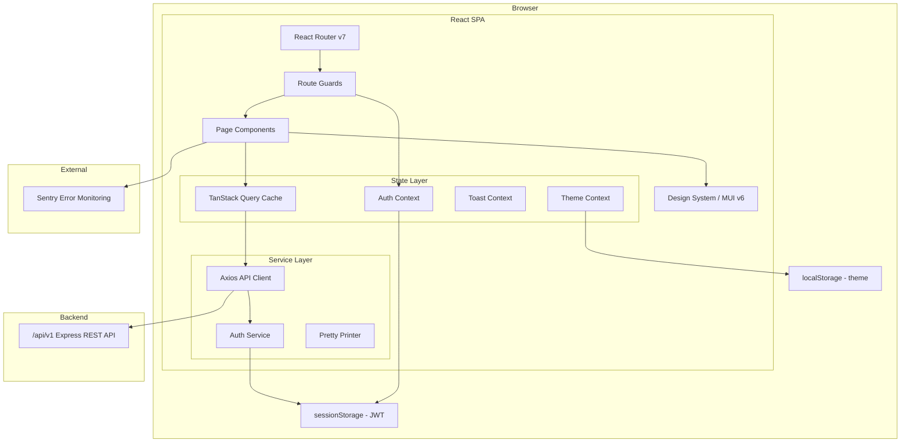
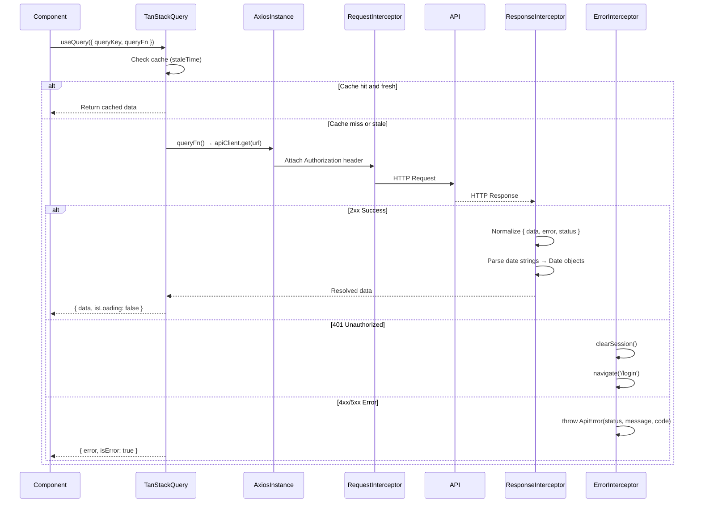
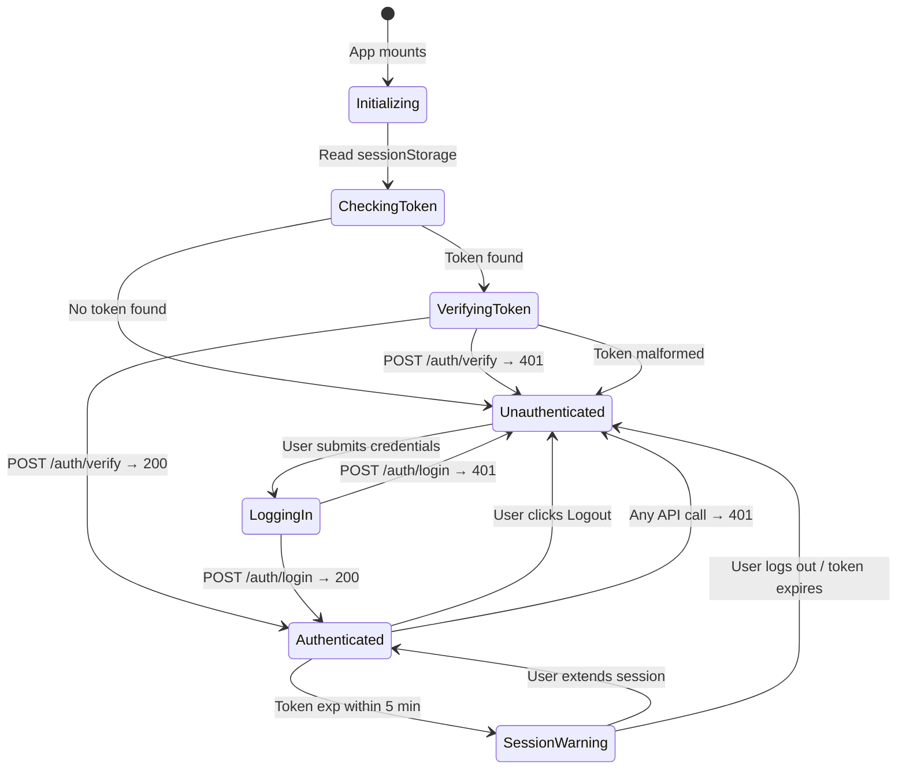
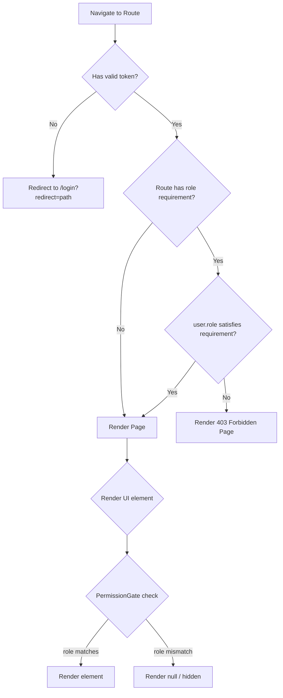
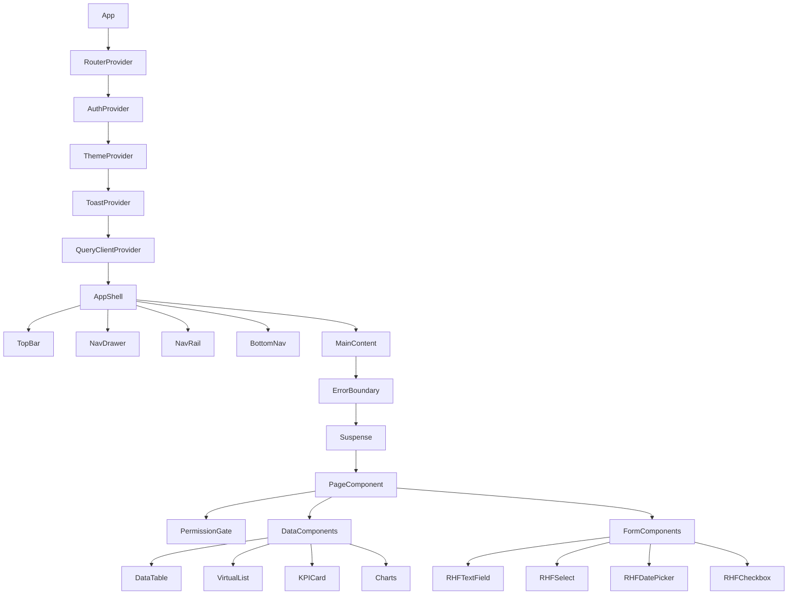
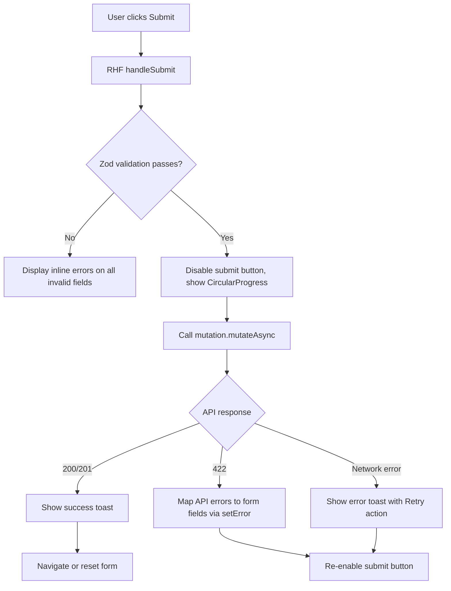
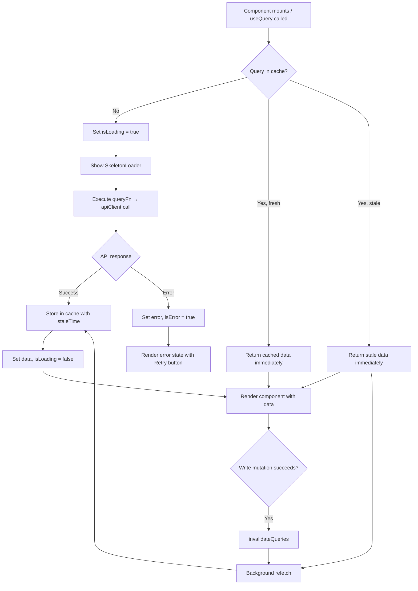
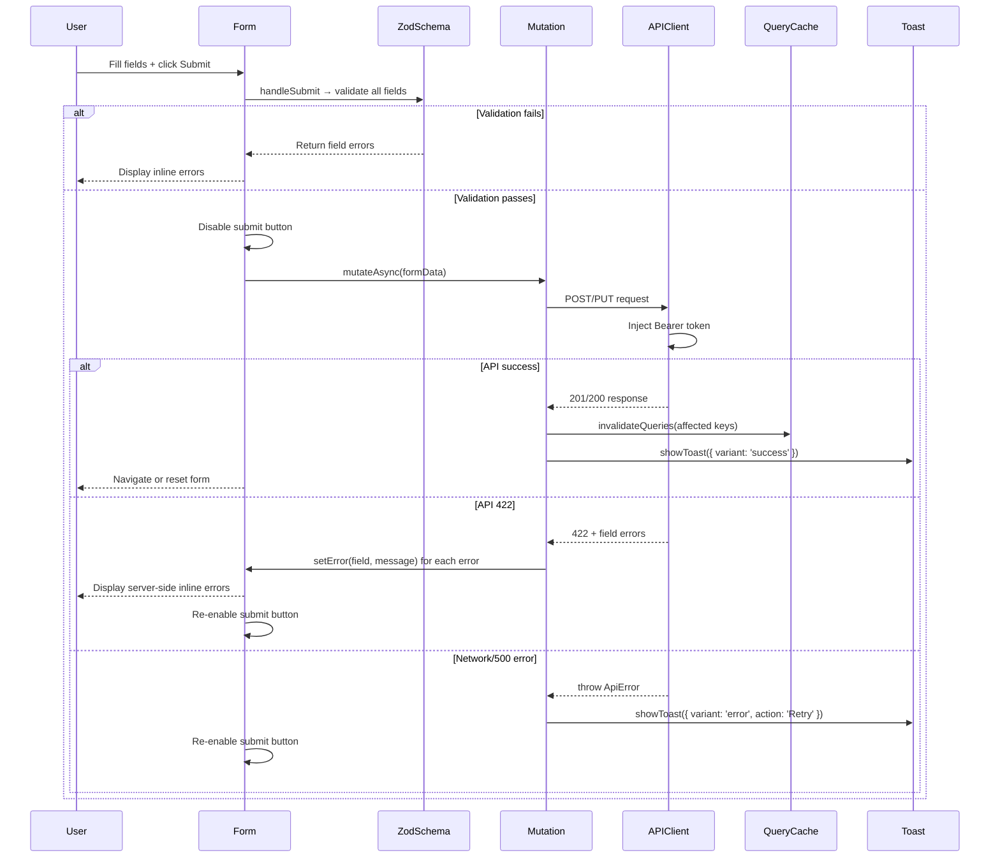
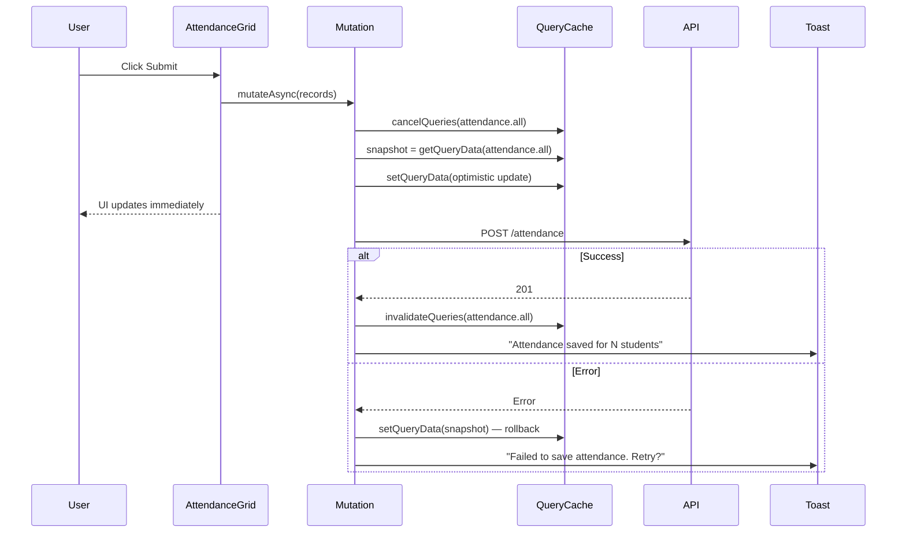
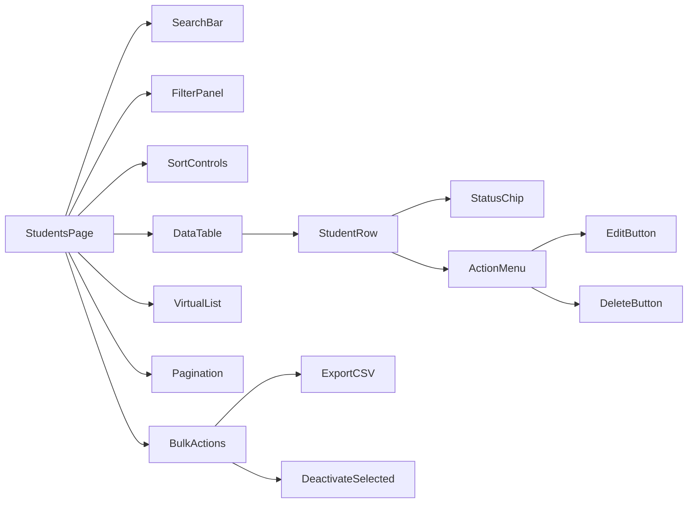

# Design Document: Enterprise Frontend System

## Overview

The Enterprise Frontend System is a production-grade React 19 + TypeScript single-page application (SPA) for the Tensor School ERP. It serves two authenticated roles — Admin and Teacher — with role-specific dashboards, navigation, and feature access across six functional modules: Students, Attendance, Fees, Exams, Timetable, and Dashboard.

### Core Objectives

- Deliver a Material Design 3 compliant UI with full light/dark mode support
- Enforce JWT-based authentication and role-based access control entirely on the client
- Provide a type-safe, interceptor-driven API client with automatic token injection and error normalization
- Achieve ≥ 90 Lighthouse scores for Performance, Accessibility, and Best Practices
- Maintain 80%+ test coverage with unit, integration, and property-based tests

### Technology Stack

| Package | Version | Justification |
|---|---|---|
| `react` | 19.x | Concurrent features, use() hook, improved Suspense |
| `typescript` | 5.x | Type safety across all layers |
| `vite` | 8.x | Fast HMR, native ESM, optimized production builds |
| `react-router-dom` | 7.x | File-based routing, data loaders, nested layouts |
| `@mui/material` | 6.x | Material Design 3 theme engine, accessible components |
| `@mui/icons-material` | 6.x | MD3 icon set |
| `@emotion/react` | 11.x | MUI peer dependency, CSS-in-JS |
| `@emotion/styled` | 11.x | MUI peer dependency |
| `@tanstack/react-query` | 5.x | Server state, caching, deduplication, background refetch |
| `axios` | 1.x | HTTP client (already installed) |
| `react-hook-form` | 7.x | Performant forms with minimal re-renders |
| `zod` | 3.x | Schema-first validation, TypeScript inference |
| `@hookform/resolvers` | 3.x | Zod adapter for React Hook Form |
| `recharts` | 2.x | Composable chart library built on D3 |
| `react-window` | 1.x | Virtualized list rendering for large datasets |
| `dompurify` | 3.x | XSS prevention via DOM sanitization |
| `@types/dompurify` | 3.x | TypeScript types for DOMPurify |
| `date-fns` | 3.x | Immutable date utilities, locale formatting |
| `vitest` | 2.x | Vite-native test runner, Jest-compatible API |
| `@testing-library/react` | 16.x | Component testing with user-centric queries |
| `@testing-library/user-event` | 14.x | Realistic user interaction simulation |
| `msw` | 2.x | Mock Service Worker for API mocking in tests |
| `fast-check` | 3.x | Property-based testing library |
| `@sentry/react` | 8.x | Error monitoring and performance tracing |
| `@sentry/vite-plugin` | 2.x | Source map upload for Sentry |

**Design System Decision — MUI v6 with MD3 Theme (not Tailwind):**
MUI v6 ships a first-class Material Design 3 theme engine (`experimental_extendTheme`, `CssVarsProvider`) with built-in accessible components, keyboard navigation, ARIA attributes, and a complete token system. Tailwind would require building all of this from scratch. For an enterprise ERP with complex data tables, dialogs, and form components, MUI's component library eliminates thousands of lines of boilerplate while staying fully customizable via the token system.


## Architecture

### High-Level Architecture



### Request Lifecycle



### Authentication Flow



### RBAC Enforcement Flow




## Components and Interfaces

### Component Hierarchy



### Layout Components

#### AppShell
```typescript
interface AppShellProps {
  children: React.ReactNode;
}
// Renders TopBar + responsive nav (Drawer/Rail/BottomNav) + <main> content area
// Reads breakpoint from useMediaQuery to switch nav variant
```

#### TopBar
```typescript
interface TopBarProps {
  title: string;
  onMenuClick: () => void; // compact only
}
// Renders: logo, page title, theme toggle IconButton, user avatar with Menu
// Uses <header> semantic element
```

#### NavDrawer / NavRail / BottomNav
```typescript
interface NavItem {
  label: string;
  icon: React.ReactNode;
  path: string;
  roles: ('admin' | 'teacher')[]; // empty = all roles
}
// All three consume the same NavItem[] config
// Active item derived from useLocation()
```

#### ProtectedRoute
```typescript
interface ProtectedRouteProps {
  children: React.ReactNode;
  requiredRole?: 'admin' | 'teacher';
}
// Reads auth state from useAuth()
// Unauthenticated → <Navigate to="/login" state={{ from: location }} />
// Wrong role → <Navigate to="/403" />
```

#### PermissionGate
```typescript
interface PermissionGateProps {
  allowedRoles: ('admin' | 'teacher')[];
  children: React.ReactNode;
  fallback?: React.ReactNode; // default: null
}
// Reads role from useAuth().user.role
// Renders children if role is in allowedRoles, else fallback
```

### Page Components

| Page | Path | Roles | Description |
|---|---|---|---|
| LoginPage | `/login` | public | Email/password form, redirects on success |
| DashboardPage | `/` | all | KPI cards, charts, quick actions |
| StudentsPage | `/students` | all | Paginated/virtual list, search, filter |
| StudentNewPage | `/students/new` | admin | Multi-step creation form |
| StudentEditPage | `/students/:id/edit` | admin | Pre-populated edit form |
| StudentProfilePage | `/students/:id` | all | Full profile, attendance, fees, marks |
| AttendancePage | `/attendance` | all | Class/section/date selector + grid |
| AttendanceStudentPage | `/attendance/student/:id` | all | Calendar view + stats |
| FeeStructuresPage | `/fees/structures` | admin | List of fee structures |
| FeeStructureNewPage | `/fees/structures/new` | admin | Create fee structure form |
| PaymentsPage | `/fees/payments` | admin | Payments list |
| PaymentNewPage | `/fees/payments/new` | admin | Record payment form |
| StudentFeePage | `/fees/student/:id` | admin | Student fee status + history |
| PendingFeesPage | `/fees/pending` | admin | Pending fees report |
| ExamsPage | `/exams` | all | Exams list with filters |
| ExamNewPage | `/exams/new` | admin | Create exam form |
| ExamMarksPage | `/exams/:id/marks` | all | Marks entry table |
| ExamResultsPage | `/exams/:id/results` | all | Class results + histogram |
| StudentResultsPage | `/exams/student/:id` | all | Student exam history |
| TimetablePage | `/timetable` | all | Weekly grid with class/section filter |
| TeacherTimetablePage | `/timetable/teacher/:id` | all | Teacher-specific schedule |
| NotFoundPage | `*` | public | 404 with Go Back |
| ForbiddenPage | `/403` | public | 403 with Return to Dashboard |

### Shared / Reusable Components

#### DataTable
```typescript
interface DataTableProps<T> {
  columns: ColumnDef<T>[];
  data: T[];
  loading?: boolean;
  onRowClick?: (row: T) => void;
  selectable?: boolean;
  onSelectionChange?: (selected: T[]) => void;
  pagination?: PaginationState;
  onPaginationChange?: (state: PaginationState) => void;
  sorting?: SortingState;
  onSortingChange?: (state: SortingState) => void;
}
```

#### VirtualList
```typescript
interface VirtualListProps<T> {
  items: T[];
  itemHeight: number;
  renderItem: (item: T, index: number) => React.ReactNode;
  overscan?: number; // default: 10
}
// Wraps react-window FixedSizeList
// Used when items.length > 100
```

#### KPICard
```typescript
interface KPICardProps {
  title: string;
  value: string | number;
  icon: React.ReactNode;
  trend?: { value: number; direction: 'up' | 'down' };
  onClick?: () => void;
  loading?: boolean;
}
```

#### SkeletonLoader
```typescript
interface SkeletonLoaderProps {
  variant: 'kpi-card' | 'table-row' | 'chart' | 'list-item';
  count?: number;
}
// Uses MUI Skeleton with animation="wave"
```

#### ConfirmDialog
```typescript
interface ConfirmDialogProps {
  open: boolean;
  title: string;
  message: string;
  confirmLabel?: string;
  onConfirm: () => void;
  onCancel: () => void;
  requireTyping?: string; // admission_no for delete confirmation
}
```

#### EmptyState
```typescript
interface EmptyStateProps {
  illustration?: React.ReactNode;
  message: string;
  action?: { label: string; onClick: () => void };
}
```

#### Breadcrumb
```typescript
// Auto-generated from react-router-dom useMatches()
// Each route defines a handle.breadcrumb function
interface RouteHandle {
  breadcrumb: (params: Params) => string;
}
```


## Data Models

### TypeScript Interfaces — API Payloads

```typescript
// ── Auth ──────────────────────────────────────────────────────────────────
export interface LoginRequest {
  email: string;
  password: string;
}

export interface LoginResponse {
  token: string;
  user: {
    id: number;
    email: string;
    role: 'admin' | 'teacher';
    firstName: string;
    lastName: string;
  };
}

export interface DecodedToken {
  userId: number;
  role: 'admin' | 'teacher';
  email: string;
  iat: number;
  exp: number;
}

// ── Students ──────────────────────────────────────────────────────────────
export interface Student {
  id: number;
  admissionNo: string;
  firstName: string;
  lastName: string;
  dateOfBirth: Date;
  gender: 'male' | 'female' | 'other';
  email?: string;
  phone?: string;
  address?: string;
  classId: number;
  sectionId: number;
  className: string;
  sectionName: string;
  admissionDate: Date;
  parentName: string;
  parentPhone: string;
  parentEmail?: string;
  isActive: boolean;
  createdAt: Date;
  updatedAt: Date;
}

export interface CreateStudentRequest {
  admissionNo: string;
  firstName: string;
  lastName: string;
  dateOfBirth: string; // ISO date
  gender: 'male' | 'female' | 'other';
  email?: string;
  phone?: string;
  address?: string;
  classId: number;
  sectionId: number;
  admissionDate: string; // ISO date
  parentName: string;
  parentPhone: string;
  parentEmail?: string;
}

export interface StudentListParams {
  page?: number;
  limit?: number;
  classId?: number;
  sectionId?: number;
  isActive?: boolean;
  search?: string;
  sortBy?: 'firstName' | 'admissionNo' | 'admissionDate';
  sortOrder?: 'asc' | 'desc';
}

// ── Attendance ────────────────────────────────────────────────────────────
export type AttendanceStatus = 'present' | 'absent' | 'late' | 'excused';

export interface AttendanceRecord {
  id: number;
  studentId: number;
  studentName: string;
  admissionNo: string;
  date: Date;
  status: AttendanceStatus;
  remarks?: string;
}

export interface MarkAttendanceRequest {
  records: Array<{
    studentId: number;
    date: string; // ISO date
    status: AttendanceStatus;
    remarks?: string;
  }>;
}

export interface AttendanceStats {
  totalDays: number;
  present: number;
  absent: number;
  late: number;
  excused: number;
  percentage: number;
}

// ── Fees ──────────────────────────────────────────────────────────────────
export interface FeeStructure {
  id: number;
  classId: number;
  className: string;
  academicYear: string;
  tuitionFee: number;
  transportFee: number;
  activityFee: number;
  otherFee: number;
  totalFee: number;
}

export interface FeePayment {
  id: number;
  studentId: number;
  academicYear: string;
  amount: number;
  paymentDate: Date;
  paymentMethod: 'cash' | 'card' | 'bank_transfer' | 'cheque' | 'online';
  transactionId?: string;
  remarks?: string;
}

export interface StudentFeeStatus {
  feeStructure: FeeStructure | null;
  totalFee: number;
  totalPaid: number;
  outstandingBalance: number;
  payments: FeePayment[];
}

// ── Exams ─────────────────────────────────────────────────────────────────
export type ExamType = 'unit_test' | 'mid_term' | 'final' | 'practical';
export type LetterGrade = 'A' | 'B' | 'C' | 'D' | 'F';

export interface Exam {
  id: number;
  name: string;
  examType: ExamType;
  classId: number;
  className: string;
  subject: string;
  maxMarks: number;
  passingMarks: number;
  examDate: Date;
}

export interface Mark {
  id: number;
  examId: number;
  studentId: number;
  studentName: string;
  admissionNo: string;
  marksObtained: number;
  isAbsent: boolean;
  remarks?: string;
  grade: LetterGrade;
  isPassed: boolean;
}

export interface ExamStatistics {
  average: number;
  highest: number;
  lowest: number;
  passCount: number;
  failCount: number;
  passPercentage: number;
  distribution: Array<{ range: string; count: number }>;
}

// ── Timetable ─────────────────────────────────────────────────────────────
export type DayOfWeek = 'monday' | 'tuesday' | 'wednesday' | 'thursday' | 'friday' | 'saturday';

export interface TimetableEntry {
  id: number;
  classId: number;
  sectionId: number;
  dayOfWeek: DayOfWeek;
  periodNumber: number;
  startTime: string; // HH:mm
  endTime: string;   // HH:mm
  subject: string;
  teacherId?: number;
  teacherName?: string;
  roomNumber?: string;
}

// ── Pagination ────────────────────────────────────────────────────────────
export interface PaginatedResponse<T> {
  items: T[];
  total: number;
  page: number;
  totalPages: number;
  limit: number;
}

// ── API Response wrapper ──────────────────────────────────────────────────
export interface ApiResponse<T> {
  data: T | null;
  error: ApiError | null;
  status: number;
}

export class ApiError extends Error {
  constructor(
    public status: number,
    public message: string,
    public code?: string,
  ) {
    super(message);
    this.name = 'ApiError';
  }
}
```

### Zod Validation Schemas

```typescript
// Student creation schema (multi-step form)
export const studentPersonalSchema = z.object({
  admissionNo: z.string().min(1, 'Required').regex(/^[A-Z0-9-]+$/, 'Invalid format'),
  firstName: z.string().trim().min(2, 'Min 2 chars').max(100, 'Max 100 chars'),
  lastName: z.string().trim().min(2, 'Min 2 chars').max(100, 'Max 100 chars'),
  dateOfBirth: z.string().refine((d) => {
    const date = new Date(d);
    const age = differenceInYears(new Date(), date);
    return age >= 3 && age <= 25;
  }, 'Student must be between 3 and 25 years old'),
  gender: z.enum(['male', 'female', 'other']),
});

export const studentAcademicSchema = z.object({
  classId: z.number().positive('Required'),
  sectionId: z.number().positive('Required'),
  admissionDate: z.string().refine((d) => new Date(d) <= new Date(), 'Cannot be in the future'),
});

export const studentParentSchema = z.object({
  parentName: z.string().trim().min(2, 'Required'),
  parentPhone: z.string().regex(/^\d{10,15}$/, '10–15 digits required'),
  parentEmail: z.string().email().optional().or(z.literal('')),
});

// Fee structure schema
export const feeStructureSchema = z.object({
  classId: z.number().positive('Required'),
  academicYear: z.string().regex(/^\d{4}-\d{4}$/, 'Format: YYYY-YYYY'),
  tuitionFee: z.number().positive('Must be positive'),
  transportFee: z.number().min(0).default(0),
  activityFee: z.number().min(0).default(0),
  otherFee: z.number().min(0).default(0),
});

// Payment schema
export const paymentSchema = z.object({
  studentId: z.number().positive('Required'),
  academicYear: z.string().regex(/^\d{4}-\d{4}$/),
  amount: z.number().positive('Amount must be greater than zero'),
  paymentDate: z.string().refine((d) => new Date(d) <= new Date(), 'Cannot be in the future'),
  paymentMethod: z.enum(['cash', 'card', 'bank_transfer', 'cheque', 'online']),
  transactionId: z.string().optional(),
  remarks: z.string().optional(),
});

// Exam schema
export const examSchema = z.object({
  name: z.string().trim().min(3).max(200),
  examType: z.enum(['unit_test', 'mid_term', 'final', 'practical']),
  classId: z.number().positive(),
  subject: z.string().trim().min(2).max(100),
  maxMarks: z.number().int().positive(),
  passingMarks: z.number().int().positive(),
  examDate: z.string(),
}).refine((d) => d.passingMarks <= d.maxMarks, {
  message: 'Passing marks must be ≤ max marks',
  path: ['passingMarks'],
});

// Timetable entry schema
export const timetableEntrySchema = z.object({
  subject: z.string().trim().min(1, 'Required'),
  teacherId: z.number().positive('Required'),
  roomNumber: z.string().optional(),
  startTime: z.string().regex(/^\d{2}:\d{2}$/),
  endTime: z.string().regex(/^\d{2}:\d{2}$/),
}).refine((d) => d.endTime > d.startTime, {
  message: 'End time must be after start time',
  path: ['endTime'],
});
```


## Project Structure

```
frontend/src/
├── main.tsx                        # App entry point, Sentry init
├── App.tsx                         # RouterProvider + global providers
│
├── config/
│   ├── env.ts                      # Validated env vars (throws if missing)
│   ├── queryClient.ts              # TanStack Query client config
│   └── sentry.ts                   # Sentry init config
│
├── theme/
│   ├── index.ts                    # CssVarsProvider theme export
│   ├── tokens.ts                   # MD3 color/spacing/elevation/motion tokens
│   ├── typography.ts               # Type scale definitions
│   └── components.ts               # MUI component overrides
│
├── router/
│   ├── index.tsx                   # createBrowserRouter with all routes
│   ├── ProtectedRoute.tsx          # Auth + role guard component
│   ├── routes.ts                   # Route path constants
│   └── handles.ts                  # Breadcrumb handle definitions
│
├── contexts/
│   ├── AuthContext.tsx             # Auth state, login/logout, token decode
│   ├── ThemeContext.tsx            # Light/dark toggle, localStorage persist
│   └── ToastContext.tsx            # Toast queue, show/dismiss
│
├── services/
│   ├── apiClient.ts                # Axios instance + interceptors
│   ├── authService.ts              # Token storage, decode, verify
│   └── prettyPrinter.ts           # formatDate, formatCurrency, parseDate
│
├── hooks/
│   ├── useAuth.ts                  # Consume AuthContext
│   ├── useTheme.ts                 # Consume ThemeContext
│   ├── useToast.ts                 # Consume ToastContext
│   ├── useStudents.ts              # TanStack Query hooks for students
│   ├── useAttendance.ts            # TanStack Query hooks for attendance
│   ├── useFees.ts                  # TanStack Query hooks for fees
│   ├── useExams.ts                 # TanStack Query hooks for exams
│   ├── useTimetable.ts             # TanStack Query hooks for timetable
│   ├── useDashboard.ts             # Dashboard KPI + chart data hooks
│   ├── useDebounce.ts              # Generic debounce hook
│   ├── useVirtualList.ts           # Threshold check + react-window wrapper
│   └── useUnsavedChanges.ts        # Prompt on navigate with dirty form
│
├── components/
│   ├── layout/
│   │   ├── AppShell.tsx            # Root layout: nav + main
│   │   ├── TopBar.tsx              # <header> with logo, title, avatar
│   │   ├── NavDrawer.tsx           # Full drawer (expanded breakpoint)
│   │   ├── NavRail.tsx             # Icon-only rail (medium breakpoint)
│   │   ├── BottomNav.tsx           # Bottom bar (compact breakpoint)
│   │   └── Breadcrumb.tsx          # Auto-generated from route handles
│   │
│   ├── guards/
│   │   ├── ProtectedRoute.tsx      # Auth + role enforcement
│   │   └── PermissionGate.tsx      # Conditional render by role
│   │
│   ├── feedback/
│   │   ├── ToastContainer.tsx      # Renders toast queue (bottom-right)
│   │   ├── Toast.tsx               # Individual toast with variants
│   │   ├── SkeletonLoader.tsx      # Variant-based skeleton placeholders
│   │   ├── EmptyState.tsx          # Illustration + message + action
│   │   ├── ErrorFallback.tsx       # Error boundary fallback UI
│   │   └── OfflineBanner.tsx       # Persistent offline indicator
│   │
│   ├── data-display/
│   │   ├── DataTable.tsx           # Sortable, selectable, paginated table
│   │   ├── VirtualList.tsx         # react-window wrapper
│   │   ├── KPICard.tsx             # Metric card with trend
│   │   ├── AttendanceCalendar.tsx  # Monthly calendar with color codes
│   │   ├── AttendanceGrid.tsx      # Bulk attendance marking grid
│   │   ├── MarksTable.tsx          # Bulk marks entry table
│   │   ├── TimetableGrid.tsx       # Weekly schedule grid
│   │   └── charts/
│   │       ├── AttendanceTrendChart.tsx  # Line chart (30-day trend)
│   │       └── FeeCollectionChart.tsx   # Bar chart (monthly collections)
│   │
│   ├── forms/
│   │   ├── RHFTextField.tsx        # RHF-controlled MUI TextField
│   │   ├── RHFSelect.tsx           # RHF-controlled MUI Select
│   │   ├── RHFDatePicker.tsx       # RHF-controlled date input
│   │   ├── RHFCheckbox.tsx         # RHF-controlled Checkbox
│   │   ├── RHFRadioGroup.tsx       # RHF-controlled RadioGroup
│   │   ├── FormErrorMessage.tsx    # Inline error with icon
│   │   └── MultiStepForm.tsx       # Step indicator + step navigation
│   │
│   └── common/
│       ├── ConfirmDialog.tsx       # Reusable confirmation dialog
│       ├── PageHeader.tsx          # Title + action buttons row
│       ├── StatusChip.tsx          # Color+icon status indicator
│       └── ExternalLink.tsx        # <a> with rel="noopener noreferrer"
│
├── pages/
│   ├── auth/
│   │   └── LoginPage.tsx
│   ├── dashboard/
│   │   └── DashboardPage.tsx
│   ├── students/
│   │   ├── StudentsPage.tsx
│   │   ├── StudentNewPage.tsx
│   │   ├── StudentEditPage.tsx
│   │   └── StudentProfilePage.tsx
│   ├── attendance/
│   │   ├── AttendancePage.tsx
│   │   └── AttendanceStudentPage.tsx
│   ├── fees/
│   │   ├── FeeStructuresPage.tsx
│   │   ├── FeeStructureNewPage.tsx
│   │   ├── PaymentsPage.tsx
│   │   ├── PaymentNewPage.tsx
│   │   ├── StudentFeePage.tsx
│   │   └── PendingFeesPage.tsx
│   ├── exams/
│   │   ├── ExamsPage.tsx
│   │   ├── ExamNewPage.tsx
│   │   ├── ExamMarksPage.tsx
│   │   ├── ExamResultsPage.tsx
│   │   └── StudentResultsPage.tsx
│   ├── timetable/
│   │   ├── TimetablePage.tsx
│   │   └── TeacherTimetablePage.tsx
│   └── errors/
│       ├── NotFoundPage.tsx
│       └── ForbiddenPage.tsx
│
├── utils/
│   ├── gradeCalculator.ts          # calculateGrade(marks, maxMarks) → LetterGrade
│   ├── attendanceCalculator.ts     # calculatePercentage(records) → number
│   ├── feeCalculator.ts            # calculateOutstanding(structure, payments)
│   ├── paginationHelper.ts         # calculateTotalPages, getPageItems
│   ├── sanitize.ts                 # DOMPurify wrapper
│   ├── routeParamValidator.ts      # validatePositiveInt(param) → number | null
│   └── csvExport.ts                # Client-side CSV generation
│
└── types/
    ├── api.ts                      # All API request/response interfaces
    ├── domain.ts                   # Domain model types
    └── env.d.ts                    # Vite env variable type declarations
```


## Design System Architecture

### Material Design 3 Theme Setup

```typescript
// theme/tokens.ts
export const colorTokens = {
  light: {
    primary: '#1565C0',
    onPrimary: '#FFFFFF',
    primaryContainer: '#D3E4FF',
    onPrimaryContainer: '#001B3E',
    secondary: '#535F70',
    onSecondary: '#FFFFFF',
    secondaryContainer: '#D7E3F7',
    onSecondaryContainer: '#101C2B',
    tertiary: '#6B5778',
    onTertiary: '#FFFFFF',
    tertiaryContainer: '#F2DAFF',
    onTertiaryContainer: '#251431',
    error: '#BA1A1A',
    onError: '#FFFFFF',
    errorContainer: '#FFDAD6',
    onErrorContainer: '#410002',
    surface: '#F8F9FF',
    onSurface: '#191C20',
    surfaceVariant: '#DFE2EB',
    onSurfaceVariant: '#43474E',
    outline: '#73777F',
    outlineVariant: '#C3C7CF',
    background: '#F8F9FF',
    onBackground: '#191C20',
  },
  dark: {
    primary: '#A4C8FF',
    onPrimary: '#003063',
    primaryContainer: '#00468C',
    onPrimaryContainer: '#D3E4FF',
    secondary: '#BBC7DB',
    onSecondary: '#253140',
    secondaryContainer: '#3B4858',
    onSecondaryContainer: '#D7E3F7',
    tertiary: '#D6BEE4',
    onTertiary: '#3B2948',
    tertiaryContainer: '#523F5F',
    onTertiaryContainer: '#F2DAFF',
    error: '#FFB4AB',
    onError: '#690005',
    errorContainer: '#93000A',
    onErrorContainer: '#FFDAD6',
    surface: '#111318',
    onSurface: '#E2E2E9',
    surfaceVariant: '#43474E',
    onSurfaceVariant: '#C3C7CF',
    outline: '#8D9199',
    outlineVariant: '#43474E',
    background: '#111318',
    onBackground: '#E2E2E9',
  },
};

export const spacingTokens = [0, 4, 8, 12, 16, 24, 32, 48, 64] as const;

export const elevationTokens = {
  0: 'none',
  1: '0px 1px 2px rgba(0,0,0,0.3), 0px 1px 3px 1px rgba(0,0,0,0.15)',
  2: '0px 1px 2px rgba(0,0,0,0.3), 0px 2px 6px 2px rgba(0,0,0,0.15)',
  3: '0px 4px 8px 3px rgba(0,0,0,0.15), 0px 1px 3px rgba(0,0,0,0.3)',
  4: '0px 6px 10px 4px rgba(0,0,0,0.15), 0px 2px 3px rgba(0,0,0,0.3)',
  5: '0px 8px 12px 6px rgba(0,0,0,0.15), 0px 4px 4px rgba(0,0,0,0.3)',
};

export const motionTokens = {
  durationShort: '100ms',
  durationMedium: '250ms',
  durationLong: '400ms',
  easingStandard: 'cubic-bezier(0.2, 0, 0, 1)',
  easingEmphasized: 'cubic-bezier(0.2, 0, 0, 1)',
  easingDecelerate: 'cubic-bezier(0, 0, 0, 1)',
  easingAccelerate: 'cubic-bezier(0.3, 0, 1, 1)',
};

export const breakpoints = {
  compact: 0,    // < 600px  → BottomNav
  medium: 600,   // 600–904px → NavRail
  expanded: 905, // ≥ 905px  → NavDrawer
};
```

```typescript
// theme/typography.ts
export const typographyScale = {
  displayLarge:  { fontSize: '3.5625rem', lineHeight: '4rem',    fontWeight: 400 },
  headlineMedium:{ fontSize: '1.75rem',   lineHeight: '2.25rem', fontWeight: 400 },
  titleLarge:    { fontSize: '1.375rem',  lineHeight: '1.75rem', fontWeight: 400 },
  titleMedium:   { fontSize: '1rem',      lineHeight: '1.5rem',  fontWeight: 500 },
  bodyLarge:     { fontSize: '1rem',      lineHeight: '1.5rem',  fontWeight: 400 },
  bodyMedium:    { fontSize: '0.875rem',  lineHeight: '1.25rem', fontWeight: 400 },
  labelLarge:    { fontSize: '0.875rem',  lineHeight: '1.25rem', fontWeight: 500 },
};
```

```typescript
// theme/index.ts — CssVarsProvider setup for light/dark
import { experimental_extendTheme as extendTheme } from '@mui/material/styles';

export const theme = extendTheme({
  colorSchemes: {
    light: { palette: colorTokens.light },
    dark:  { palette: colorTokens.dark },
  },
  typography: typographyScale,
  spacing: 4, // base unit = 4px
  shape: { borderRadius: 12 }, // MD3 rounded corners
  components: { /* overrides in theme/components.ts */ },
});
```

### ThemeContext

```typescript
// contexts/ThemeContext.tsx
interface ThemeContextValue {
  mode: 'light' | 'dark' | 'system';
  setMode: (mode: 'light' | 'dark' | 'system') => void;
  resolvedMode: 'light' | 'dark';
}
// Persists to localStorage key 'tensor-theme-mode'
// Listens to window.matchMedia('(prefers-color-scheme: dark)') for system mode
// Passes colorScheme prop to CssVarsProvider
```


## Authentication Architecture

### Auth Service

```typescript
// services/authService.ts
const TOKEN_KEY = 'tensor_auth_token';

export const authService = {
  // Store token — sessionStorage only, never localStorage
  storeToken(token: string): void {
    sessionStorage.setItem(TOKEN_KEY, token);
  },

  // Retrieve token
  getToken(): string | null {
    return sessionStorage.getItem(TOKEN_KEY);
  },

  // Clear all session data
  clearSession(): void {
    sessionStorage.clear();
  },

  // Decode JWT payload without verification (client-side only)
  // Returns null for malformed tokens
  decodeToken(token: string): DecodedToken | null {
    try {
      const [, payload] = token.split('.');
      const decoded = JSON.parse(atob(payload.replace(/-/g, '+').replace(/_/g, '/')));
      if (!decoded.userId || !decoded.role || !decoded.exp) return null;
      return decoded as DecodedToken;
    } catch {
      return null;
    }
  },

  // Check if token is within 5 minutes of expiry
  isNearExpiry(token: string): boolean {
    const decoded = authService.decodeToken(token);
    if (!decoded) return true;
    const fiveMinutes = 5 * 60 * 1000;
    return (decoded.exp * 1000) - Date.now() < fiveMinutes;
  },

  // Check if token is expired
  isExpired(token: string): boolean {
    const decoded = authService.decodeToken(token);
    if (!decoded) return true;
    return decoded.exp * 1000 < Date.now();
  },
};
```

### Auth Context

```typescript
// contexts/AuthContext.tsx
type AuthStatus = 'initializing' | 'authenticated' | 'unauthenticated';

interface AuthState {
  status: AuthStatus;
  user: DecodedToken | null;
  token: string | null;
}

interface AuthContextValue extends AuthState {
  login: (email: string, password: string) => Promise<void>;
  logout: () => void;
  isAdmin: boolean;
  isTeacher: boolean;
}

// On mount: reads token from sessionStorage, calls POST /api/v1/auth/verify
// On 401 from verify: clears session, sets status = 'unauthenticated'
// Expiry check: useEffect with setInterval every 60s, shows SessionWarningModal
```

### Axios Interceptor Chain

```typescript
// services/apiClient.ts
import axios from 'axios';
import { authService } from './authService';

export const apiClient = axios.create({
  baseURL: import.meta.env.VITE_API_BASE_URL,
  headers: { 'Content-Type': 'application/json' },
  timeout: 30_000,
});

// Request interceptor: inject Bearer token
apiClient.interceptors.request.use((config) => {
  const token = authService.getToken();
  if (token) {
    config.headers.Authorization = `Bearer ${token}`;
  }
  return config;
});

// Response interceptor: normalize shape + parse dates
apiClient.interceptors.response.use(
  (response) => {
    const normalized: ApiResponse<unknown> = {
      data: parseDates(response.data?.data ?? response.data),
      error: null,
      status: response.status,
    };
    return { ...response, data: normalized };
  },
  (error) => {
    const status = error.response?.status;
    const message = error.response?.data?.message ?? 'Server error. Please try again.';
    const code = error.response?.data?.code;

    if (status === 401) {
      authService.clearSession();
      window.dispatchEvent(new CustomEvent('auth:session-expired'));
    }

    return Promise.reject(new ApiError(status ?? 0, message, code));
  },
);

// Typed paginated fetch helper
export async function fetchPaginated<T>(
  url: string,
  params: { page: number; limit: number } & Record<string, unknown>,
  signal?: AbortSignal,
): Promise<PaginatedResponse<T>> {
  const response = await apiClient.get(url, { params, signal });
  const { data, pagination } = response.data.data;
  return {
    items: data,
    total: pagination.totalRecords,
    page: pagination.currentPage,
    totalPages: pagination.totalPages,
    limit: pagination.limit,
  };
}
```

### Session Expiry Warning

```typescript
// Runs inside AuthContext via useEffect
// Every 60 seconds, checks authService.isNearExpiry(token)
// If near expiry: sets showWarning = true → renders SessionWarningModal
// Modal options: "Extend Session" (calls POST /auth/verify to refresh) | "Log Out"
// If token expires while modal is open: auto-logout with toast "Session expired"
```


## Routing Architecture

### Route Tree

```typescript
// router/index.tsx
export const router = createBrowserRouter([
  {
    path: '/login',
    element: <LoginPage />,
  },
  {
    path: '/',
    element: <ProtectedRoute><AppShell /></ProtectedRoute>,
    children: [
      { index: true, element: <DashboardPage />, handle: { breadcrumb: () => 'Dashboard' } },

      // Students
      { path: 'students', element: <StudentsPage />, handle: { breadcrumb: () => 'Students' } },
      { path: 'students/new', element: <ProtectedRoute requiredRole="admin"><StudentNewPage /></ProtectedRoute>, handle: { breadcrumb: () => 'Add Student' } },
      { path: 'students/:id', element: <StudentProfilePage />, handle: { breadcrumb: (p) => `Student #${p.id}` } },
      { path: 'students/:id/edit', element: <ProtectedRoute requiredRole="admin"><StudentEditPage /></ProtectedRoute>, handle: { breadcrumb: () => 'Edit' } },

      // Attendance
      { path: 'attendance', element: <AttendancePage />, handle: { breadcrumb: () => 'Attendance' } },
      { path: 'attendance/student/:id', element: <AttendanceStudentPage />, handle: { breadcrumb: () => 'Student Attendance' } },

      // Fees (admin only)
      { path: 'fees/structures', element: <ProtectedRoute requiredRole="admin"><FeeStructuresPage /></ProtectedRoute>, handle: { breadcrumb: () => 'Fee Structures' } },
      { path: 'fees/structures/new', element: <ProtectedRoute requiredRole="admin"><FeeStructureNewPage /></ProtectedRoute>, handle: { breadcrumb: () => 'New Fee Structure' } },
      { path: 'fees/payments', element: <ProtectedRoute requiredRole="admin"><PaymentsPage /></ProtectedRoute>, handle: { breadcrumb: () => 'Payments' } },
      { path: 'fees/payments/new', element: <ProtectedRoute requiredRole="admin"><PaymentNewPage /></ProtectedRoute>, handle: { breadcrumb: () => 'Record Payment' } },
      { path: 'fees/student/:id', element: <ProtectedRoute requiredRole="admin"><StudentFeePage /></ProtectedRoute>, handle: { breadcrumb: () => 'Fee Status' } },
      { path: 'fees/pending', element: <ProtectedRoute requiredRole="admin"><PendingFeesPage /></ProtectedRoute>, handle: { breadcrumb: () => 'Pending Fees' } },

      // Exams
      { path: 'exams', element: <ExamsPage />, handle: { breadcrumb: () => 'Exams' } },
      { path: 'exams/new', element: <ProtectedRoute requiredRole="admin"><ExamNewPage /></ProtectedRoute>, handle: { breadcrumb: () => 'Create Exam' } },
      { path: 'exams/:id/marks', element: <ExamMarksPage />, handle: { breadcrumb: () => 'Marks Entry' } },
      { path: 'exams/:id/results', element: <ExamResultsPage />, handle: { breadcrumb: () => 'Results' } },
      { path: 'exams/student/:id', element: <StudentResultsPage />, handle: { breadcrumb: () => 'Student Results' } },

      // Timetable
      { path: 'timetable', element: <TimetablePage />, handle: { breadcrumb: () => 'Timetable' } },
      { path: 'timetable/teacher/:id', element: <TeacherTimetablePage />, handle: { breadcrumb: () => 'Teacher Schedule' } },

      // Errors
      { path: '403', element: <ForbiddenPage /> },
      { path: '*', element: <NotFoundPage /> },
    ],
  },
]);
```

### Lazy Loading Strategy

```typescript
// All page components are lazy-loaded
const DashboardPage = lazy(() => import('../pages/dashboard/DashboardPage'));
const StudentsPage = lazy(() => import('../pages/students/StudentsPage'));
// ... etc for all pages

// Each lazy route is wrapped in Suspense with a page-level skeleton
<Suspense fallback={<PageSkeleton />}>
  <DashboardPage />
</Suspense>

// Charts are additionally lazy-loaded within the dashboard
const AttendanceTrendChart = lazy(() => import('../components/data-display/charts/AttendanceTrendChart'));
const FeeCollectionChart = lazy(() => import('../components/data-display/charts/FeeCollectionChart'));
```

### Route Parameter Validation

```typescript
// utils/routeParamValidator.ts
export function validatePositiveInt(param: string | undefined): number | null {
  if (!param) return null;
  const n = parseInt(param, 10);
  if (isNaN(n) || n <= 0 || String(n) !== param) return null;
  return n;
}

// Usage in page components:
const { id } = useParams();
const studentId = validatePositiveInt(id);
if (!studentId) return <NotFoundPage />;
```


## State Management Architecture

### TanStack Query Configuration

```typescript
// config/queryClient.ts
import { QueryClient } from '@tanstack/react-query';

export const queryClient = new QueryClient({
  defaultOptions: {
    queries: {
      staleTime: 5 * 60 * 1000,       // 5 minutes — data considered fresh
      gcTime: 10 * 60 * 1000,          // 10 minutes — cache garbage collection
      retry: (failureCount, error) => {
        if (error instanceof ApiError && error.status < 500) return false;
        return failureCount < 3;
      },
      retryDelay: (attempt) => Math.min(1000 * 2 ** attempt, 4000), // 1s, 2s, 4s
      refetchOnWindowFocus: true,
      refetchOnReconnect: true,
    },
    mutations: {
      retry: false,
    },
  },
});
```

### Query Key Factory

```typescript
// Centralized query key definitions for consistent cache invalidation
export const queryKeys = {
  students: {
    all: ['students'] as const,
    lists: () => [...queryKeys.students.all, 'list'] as const,
    list: (params: StudentListParams) => [...queryKeys.students.lists(), params] as const,
    detail: (id: number) => [...queryKeys.students.all, 'detail', id] as const,
  },
  attendance: {
    all: ['attendance'] as const,
    class: (classId: number, sectionId: number, date: string) =>
      [...queryKeys.attendance.all, 'class', classId, sectionId, date] as const,
    student: (studentId: number, start: string, end: string) =>
      [...queryKeys.attendance.all, 'student', studentId, start, end] as const,
  },
  fees: {
    structures: () => ['fees', 'structures'] as const,
    payments: () => ['fees', 'payments'] as const,
    studentStatus: (studentId: number, year: string) =>
      ['fees', 'student', studentId, year] as const,
    pending: () => ['fees', 'pending'] as const,
  },
  exams: {
    all: ['exams'] as const,
    list: (params: object) => [...queryKeys.exams.all, 'list', params] as const,
    detail: (id: number) => [...queryKeys.exams.all, 'detail', id] as const,
    marks: (examId: number) => [...queryKeys.exams.all, 'marks', examId] as const,
    results: (examId: number) => [...queryKeys.exams.all, 'results', examId] as const,
    studentResults: (studentId: number) => [...queryKeys.exams.all, 'student', studentId] as const,
  },
  timetable: {
    class: (classId: number, sectionId: number) =>
      ['timetable', 'class', classId, sectionId] as const,
    teacher: (teacherId: number) => ['timetable', 'teacher', teacherId] as const,
  },
  dashboard: {
    kpis: () => ['dashboard', 'kpis'] as const,
    attendanceTrend: () => ['dashboard', 'attendance-trend'] as const,
    feeCollection: () => ['dashboard', 'fee-collection'] as const,
    recentActivity: () => ['dashboard', 'recent-activity'] as const,
  },
};
```

### Custom Domain Hooks

```typescript
// hooks/useStudents.ts
export function useStudentList(params: StudentListParams) {
  return useQuery({
    queryKey: queryKeys.students.list(params),
    queryFn: ({ signal }) => fetchPaginated<Student>('/students', params, signal),
    placeholderData: keepPreviousData, // smooth pagination
  });
}

export function useStudent(id: number) {
  return useQuery({
    queryKey: queryKeys.students.detail(id),
    queryFn: ({ signal }) => apiClient.get(`/students/${id}`, { signal }).then(r => r.data.data),
    enabled: id > 0,
  });
}

export function useCreateStudent() {
  return useMutation({
    mutationFn: (data: CreateStudentRequest) => apiClient.post('/students', data),
    onSuccess: () => {
      queryClient.invalidateQueries({ queryKey: queryKeys.students.lists() });
    },
  });
}

export function useDeleteStudent() {
  return useMutation({
    mutationFn: (id: number) => apiClient.delete(`/students/${id}`),
    onSuccess: (_, id) => {
      queryClient.invalidateQueries({ queryKey: queryKeys.students.lists() });
      queryClient.removeQueries({ queryKey: queryKeys.students.detail(id) });
    },
  });
}
```

```typescript
// hooks/useAttendance.ts — optimistic update example
export function useMarkAttendance() {
  return useMutation({
    mutationFn: (data: MarkAttendanceRequest) => apiClient.post('/attendance', data),
    onMutate: async (newData) => {
      // Cancel outgoing refetches
      await queryClient.cancelQueries({ queryKey: queryKeys.attendance.all });
      // Snapshot previous value
      const snapshot = queryClient.getQueryData(queryKeys.attendance.all);
      // Optimistically update
      queryClient.setQueryData(queryKeys.attendance.all, (old: unknown) =>
        applyOptimisticAttendance(old, newData)
      );
      return { snapshot };
    },
    onError: (_, __, context) => {
      // Roll back on error
      queryClient.setQueryData(queryKeys.attendance.all, context?.snapshot);
    },
    onSettled: () => {
      queryClient.invalidateQueries({ queryKey: queryKeys.attendance.all });
    },
  });
}
```

### Cache Invalidation Strategy

| Write Operation | Invalidated Query Keys |
|---|---|
| Create student | `students.lists()` |
| Update student | `students.lists()`, `students.detail(id)` |
| Delete student | `students.lists()`, `students.detail(id)` |
| Mark attendance | `attendance.class(...)`, `attendance.student(...)`, `dashboard.kpis()` |
| Create fee structure | `fees.structures()` |
| Record payment | `fees.payments()`, `fees.studentStatus(id, year)`, `fees.pending()`, `dashboard.kpis()` |
| Create exam | `exams.list(...)` |
| Submit marks | `exams.marks(examId)`, `exams.results(examId)`, `exams.studentResults(studentId)` |
| Create timetable entry | `timetable.class(...)`, `timetable.teacher(...)` |
| Delete timetable entry | `timetable.class(...)`, `timetable.teacher(...)` |


## Form Architecture

### React Hook Form + Zod Integration Pattern

```typescript
// components/forms/RHFTextField.tsx
interface RHFTextFieldProps extends Omit<TextFieldProps, 'name'> {
  name: string;
  control: Control<FieldValues>;
}

export function RHFTextField({ name, control, ...props }: RHFTextFieldProps) {
  return (
    <Controller
      name={name}
      control={control}
      render={({ field, fieldState }) => (
        <TextField
          {...field}
          {...props}
          error={!!fieldState.error}
          helperText={
            fieldState.error ? (
              <FormErrorMessage message={fieldState.error.message!} />
            ) : props.helperText
          }
          inputProps={{
            ...props.inputProps,
            'aria-describedby': fieldState.error ? `${name}-error` : undefined,
          }}
        />
      )}
    />
  );
}
```

### Multi-Step Form Pattern (Student Creation)

```typescript
// pages/students/StudentNewPage.tsx
const STEPS = ['Personal Info', 'Contact & Address', 'Academic Info', 'Parent/Guardian'];

export function StudentNewPage() {
  const [step, setStep] = useState(0);
  const methods = useForm<StudentFormData>({
    resolver: zodResolver(studentFullSchema),
    mode: 'onBlur',
  });

  const handleNext = async () => {
    const stepFields = getStepFields(step); // returns field names for current step
    const valid = await methods.trigger(stepFields);
    if (valid) setStep((s) => s + 1);
  };

  return (
    <FormProvider {...methods}>
      <MultiStepForm steps={STEPS} currentStep={step}>
        {step === 0 && <PersonalInfoStep />}
        {step === 1 && <ContactStep />}
        {step === 2 && <AcademicStep />}
        {step === 3 && <ParentStep onSubmit={methods.handleSubmit(onSubmit)} />}
      </MultiStepForm>
    </FormProvider>
  );
}
```

### Form Submission Flow



### Pretty Printer

```typescript
// services/prettyPrinter.ts
import { format, parse, isValid } from 'date-fns';

export const prettyPrinter = {
  // Display format: DD/MM/YYYY
  formatDate(date: Date | string): string {
    const d = typeof date === 'string' ? new Date(date) : date;
    return format(d, 'dd/MM/yyyy');
  },

  // API payload format: YYYY-MM-DD
  toApiDate(date: Date): string {
    return format(date, 'yyyy-MM-dd');
  },

  // Parse display format back to Date
  parseDate(str: string): Date {
    return parse(str, 'dd/MM/yyyy', new Date());
  },

  // Currency: locale-formatted with 2 decimal places
  formatCurrency(amount: number, locale = 'en-IN'): string {
    return new Intl.NumberFormat(locale, {
      minimumFractionDigits: 2,
      maximumFractionDigits: 2,
    }).format(amount);
  },

  // Parse formatted currency back to number
  parseCurrency(str: string): number {
    return parseFloat(str.replace(/[^0-9.-]/g, ''));
  },
};
```


## Security Implementation

### XSS Prevention

```typescript
// utils/sanitize.ts
import DOMPurify from 'dompurify';

export function sanitize(dirty: string): string {
  return DOMPurify.sanitize(dirty, { ALLOWED_TAGS: [], ALLOWED_ATTR: [] });
}

// Usage: any user-supplied string rendered in JSX goes through sanitize()
// React's JSX escaping handles most cases, but sanitize() is used for:
// - Dynamic content rendered via dangerouslySetInnerHTML (only with sanitized input)
// - Content from API that may contain HTML (student names, remarks, etc.)
```

### Content Security Policy

```html
<!-- index.html -->
<meta http-equiv="Content-Security-Policy"
  content="default-src 'self';
           script-src 'self';
           style-src 'self' 'unsafe-inline';
           img-src 'self' data: https:;
           connect-src 'self' https://api.tensor.school https://*.sentry.io;
           font-src 'self';
           frame-ancestors 'none';" />
```

### Input Sanitization in Zod

```typescript
// All text fields use .trim() to strip whitespace before validation
// This satisfies Requirement 15.9 and 20.10
const nameField = z.string().trim().min(2).max(100);

// Route param validation before any API call
function useValidatedId(paramName: string): number {
  const params = useParams();
  const id = validatePositiveInt(params[paramName]);
  if (!id) throw new Response('Not Found', { status: 404 });
  return id;
}
```

### Production Security

```typescript
// services/apiClient.ts — no token in logs
// Development only logging:
if (import.meta.env.DEV) {
  apiClient.interceptors.request.use((config) => {
    console.log(`[API] ${config.method?.toUpperCase()} ${config.url}`);
    // Never log config.headers.Authorization
    return config;
  });
}
```

## Performance Architecture

### Code Splitting Strategy

```
Initial bundle (< 50KB gzipped):
  - React runtime
  - React Router
  - Auth context + login page

Vendor chunk (< 200KB gzipped):
  - MUI core
  - Emotion
  - Axios
  - date-fns

Per-route chunks (< 100KB each):
  - DashboardPage + KPICard + SkeletonLoader
  - StudentsPage + DataTable + VirtualList
  - AttendancePage + AttendanceGrid
  - FeesPage + fee components
  - ExamsPage + MarksTable
  - TimetablePage + TimetableGrid

Deferred chunks (loaded on first use):
  - Recharts (charts only loaded when dashboard renders)
  - react-window (loaded when list > 100 items)
```

### Virtual List Threshold

```typescript
// hooks/useVirtualList.ts
const VIRTUAL_LIST_THRESHOLD = 100;

export function useVirtualList<T>(items: T[]) {
  const shouldVirtualize = items.length > VIRTUAL_LIST_THRESHOLD;
  return { shouldVirtualize, items };
}

// In StudentsPage:
const { shouldVirtualize, items } = useVirtualList(students);
return shouldVirtualize
  ? <VirtualList items={items} itemHeight={56} renderItem={renderStudentRow} overscan={10} />
  : <DataTable data={items} columns={studentColumns} />;
```

### Dashboard Auto-Refresh

```typescript
// hooks/useDashboard.ts
export function useDashboardKPIs() {
  return useQuery({
    queryKey: queryKeys.dashboard.kpis(),
    queryFn: fetchDashboardKPIs,
    refetchInterval: 5 * 60 * 1000,      // 5 minutes
    refetchIntervalInBackground: false,   // only when tab is active
  });
}
```

### Prefetch Strategy

```html
<!-- index.html — prefetch dashboard after login page loads -->
<link rel="prefetch" href="/assets/DashboardPage.js" as="script" />
```

```typescript
// LoginPage.tsx — programmatic prefetch after successful login
const prefetchDashboard = () => {
  queryClient.prefetchQuery({
    queryKey: queryKeys.dashboard.kpis(),
    queryFn: fetchDashboardKPIs,
  });
};
```


## Build & Deployment

### Vite Configuration

```typescript
// vite.config.ts
import { defineConfig, loadEnv } from 'vite';
import react from '@vitejs/plugin-react';
import { sentryVitePlugin } from '@sentry/vite-plugin';

export default defineConfig(({ mode }) => {
  const env = loadEnv(mode, process.cwd(), '');

  // Fail build if required env vars are missing
  const required = ['VITE_API_BASE_URL'];
  for (const key of required) {
    if (!env[key]) throw new Error(`Missing required env var: ${key}`);
  }

  return {
    plugins: [
      react(),
      sentryVitePlugin({
        org: env.SENTRY_ORG,
        project: env.SENTRY_PROJECT,
        authToken: env.SENTRY_AUTH_TOKEN,
        sourcemaps: { assets: './dist/**' },
      }),
    ],
    build: {
      sourcemap: true, // stored separately, not served to users
      rollupOptions: {
        output: {
          manualChunks: {
            vendor: ['react', 'react-dom', 'react-router-dom'],
            mui: ['@mui/material', '@emotion/react', '@emotion/styled'],
            query: ['@tanstack/react-query'],
            charts: ['recharts'],
          },
        },
        // Warn if any chunk exceeds 250KB gzipped
        chunkSizeWarningLimit: 250,
      },
    },
  };
});
```

### Environment Files

```bash
# .env.development
VITE_API_BASE_URL=http://localhost:3000/api/v1
VITE_ENV=development
VITE_SENTRY_DSN=

# .env.production
VITE_API_BASE_URL=https://api.tensor.school/api/v1
VITE_ENV=production
VITE_SENTRY_DSN=https://xxx@sentry.io/xxx
```

### Deployment Configuration

```toml
# netlify.toml
[build]
  command = "npm run build"
  publish = "dist"

[[redirects]]
  from = "/*"
  to = "/index.html"
  status = 200

[[headers]]
  for = "/assets/*"
  [headers.values]
    Cache-Control = "public, max-age=31536000, immutable"

[[headers]]
  for = "/index.html"
  [headers.values]
    Cache-Control = "no-cache, no-store, must-revalidate"
    Content-Security-Policy = "default-src 'self'; script-src 'self'; style-src 'self' 'unsafe-inline'; img-src 'self' data: https:; connect-src 'self' https://api.tensor.school https://*.sentry.io; font-src 'self'; frame-ancestors 'none';"
```

```json
// vercel.json
{
  "rewrites": [{ "source": "/(.*)", "destination": "/index.html" }],
  "headers": [
    {
      "source": "/assets/(.*)",
      "headers": [{ "key": "Cache-Control", "value": "public, max-age=31536000, immutable" }]
    },
    {
      "source": "/index.html",
      "headers": [{ "key": "Cache-Control", "value": "no-cache, no-store, must-revalidate" }]
    }
  ]
}
```

### Sentry Integration

```typescript
// main.tsx
import * as Sentry from '@sentry/react';

Sentry.init({
  dsn: import.meta.env.VITE_SENTRY_DSN,
  environment: import.meta.env.VITE_ENV,
  enabled: import.meta.env.VITE_ENV === 'production',
  integrations: [
    Sentry.browserTracingIntegration(),
    Sentry.replayIntegration({ maskAllText: true, blockAllMedia: true }),
  ],
  tracesSampleRate: 0.1,
  replaysOnErrorSampleRate: 1.0,
  beforeSend(event) {
    // Include role but never userId or personal data
    const role = sessionStorage.getItem('tensor_user_role');
    if (role) event.user = { role };
    return event;
  },
});
```


## Correctness Properties

*A property is a characteristic or behavior that should hold true across all valid executions of a system — essentially, a formal statement about what the system should do. Properties serve as the bridge between human-readable specifications and machine-verifiable correctness guarantees.*

---

### Property 1: Bearer Token Injection

*For any* outgoing API request made while a valid token is stored in sessionStorage, the request's `Authorization` header SHALL equal `"Bearer " + token`.

**Validates: Requirements 1.3, 18.2**

---

### Property 2: Token Decode Invariant

*For any* valid JWT string `t`, `authService.decodeToken(t).exp` SHALL be a number strictly greater than `authService.decodeToken(t).iat`, and the decoded object SHALL contain `userId`, `role`, and `exp` fields.

**Validates: Requirements 1.9, 20.5**

---

### Property 3: Malformed Token Rejection

*For any* string that is not a valid three-part base64url JWT, `authService.decodeToken(token)` SHALL return `null` and the session SHALL be treated as invalid.

**Validates: Requirements 1.10**

---

### Property 4: 401 Response Clears Session

*For any* API response with HTTP status 401, the Axios response interceptor SHALL call `authService.clearSession()` and dispatch the `auth:session-expired` event, regardless of which endpoint returned the 401.

**Validates: Requirements 1.5, 12.6**

---

### Property 5: Unauthenticated Route Redirect

*For any* protected route path, navigating to it without a valid token in sessionStorage SHALL result in a redirect to `/login` with the original path preserved as `state.from`.

**Validates: Requirements 2.1**

---

### Property 6: Role-Based Route Enforcement

*For any* route that requires the `admin` role, a user with `role === 'teacher'` navigating to that route SHALL be redirected to `/403`, never to the page content.

**Validates: Requirements 2.2, 2.8**

---

### Property 7: Teacher Permission Gate

*For any* Teacher-role user, the PermissionGate component wrapping admin-only controls (Add Student, Edit Student, Delete Student, fee write controls, Create Exam, timetable write controls) SHALL render `null` (not the children).

**Validates: Requirements 2.3, 2.4, 2.5, 2.6, 2.7, 2.11**

---

### Property 8: Validator Idempotence

*For any* input value `v`, running `validate(validate(v))` SHALL produce the same result as `validate(v)` — validation is idempotent and has no side effects on the input.

**Validates: Requirements 20.1**

---

### Property 9: Name Validator Whitespace Invariance

*For any* string `s` where `s.trim().length >= 2 && s.trim().length <= 100`, the name validator SHALL return valid regardless of leading or trailing whitespace in `s`.

**Validates: Requirements 15.9, 20.10**

---

### Property 10: Amount Validator Rejects Non-Positive Values

*For any* number `n` where `n <= 0`, the amount validator SHALL return an error. *For any* number `n` where `n > 0`, the amount validator SHALL return valid.

**Validates: Requirements 8.12, 16.6**

---

### Property 11: Date Round-Trip

*For any* valid ISO date string `s`, `prettyPrinter.formatDate(prettyPrinter.parseDate(prettyPrinter.formatDate(new Date(s))))` SHALL produce a string that when parsed equals the original date (day-level precision).

**Validates: Requirements 11.12, 16.7, 20.2**

---

### Property 12: Currency Round-Trip

*For any* non-negative number `n` with at most 2 decimal places, `prettyPrinter.parseCurrency(prettyPrinter.formatCurrency(n))` SHALL equal `n`.

**Validates: Requirements 11.12, 16.8, 20.3**

---

### Property 13: API Serializer Round-Trip

*For any* valid API response object `r`, `deserialize(serialize(r))` SHALL produce an object deeply equal to `r` — all field values, types, and nested structures are preserved.

**Validates: Requirements 18.6, 20.4**

---

### Property 14: Grade Calculator Monotonicity

*For any* two marks values `a` and `b` where `a > b` and both are in `[0, maxMarks]`, `calculateGrade(a, maxMarks)` SHALL be greater than or equal to `calculateGrade(b, maxMarks)` — higher marks never produce a lower grade.

**Validates: Requirements 9.11, 20.6**

---

### Property 15: Attendance Percentage Bounds

*For any* collection of attendance records, `calculateAttendancePercentage(records)` SHALL return a number in the closed interval `[0, 100]`.

**Validates: Requirements 7.8, 20.7**

---

### Property 16: Pagination Invariant

*For any* response with `total` items and `pageSize` per page, `totalPages === Math.ceil(total / pageSize)`, and the number of items on the last page SHALL be `total % pageSize` (or `pageSize` if evenly divisible).

**Validates: Requirements 18.8, 20.8**

---

### Property 17: Fee Outstanding Balance Invariant

*For any* student, `outstandingBalance === totalFee - totalPaid` and `outstandingBalance >= 0`. Payments cannot cause the outstanding balance to go negative.

**Validates: Requirements 20.9**

---

### Property 18: Fee Total Equals Sum of Components

*For any* fee structure, `totalFee === tuitionFee + transportFee + activityFee + otherFee`. This invariant holds both in the form's real-time computed display and in the submitted payload.

**Validates: Requirements 8.3**

---

### Property 19: Exam Marks Bounds

*For any* marks entry, `marksObtained` SHALL be in `[0, maxMarks]`. When `isAbsent === true`, `marksObtained` SHALL be `0` or empty.

**Validates: Requirements 9.6**

---

### Property 20: Passing Marks Constraint

*For any* exam, `passingMarks <= maxMarks`. The exam creation form SHALL reject any configuration where this invariant is violated.

**Validates: Requirements 9.3**

---

### Property 21: Timetable Time Order

*For any* timetable entry, `endTime > startTime`. The timetable form SHALL reject entries where this invariant is violated.

**Validates: Requirements 10.4**

---

### Property 22: XSS Sanitization

*For any* user-supplied string `s`, `sanitize(s)` SHALL return a string that contains no `<script>` tags, no `javascript:` protocol handlers, and no inline event handlers (`on*` attributes).

**Validates: Requirements 15.2**

---

### Property 23: Route Parameter Validation

*For any* string `s` that is not a positive integer (i.e., not matching `/^[1-9]\d*$/`), `validatePositiveInt(s)` SHALL return `null`, causing the page to render the 404 component.

**Validates: Requirements 15.8**

---

### Property 24: Toast Stack Limit

*For any* sequence of toast show calls, at most 3 toasts SHALL be visible simultaneously. Additional toasts SHALL be queued and shown only after a visible toast is dismissed.

**Validates: Requirements 12.3**

---

### Property 25: Virtual List Threshold

*For any* list with more than 100 items, the component SHALL render a VirtualList (react-window). *For any* list with 100 or fewer items, the component SHALL render a standard DataTable.

**Validates: Requirements 6.6, 13.5**


## Error Handling

### Error Boundary Strategy

```typescript
// components/feedback/ErrorFallback.tsx
interface ErrorFallbackProps {
  error: Error;
  resetErrorBoundary: () => void;
}

export function ErrorFallback({ resetErrorBoundary }: ErrorFallbackProps) {
  return (
    <Box role="alert" sx={{ p: 3, textAlign: 'center' }}>
      <Typography variant="titleMedium">Something went wrong</Typography>
      <Button onClick={resetErrorBoundary} sx={{ mt: 2 }}>Reload Section</Button>
    </Box>
  );
}

// Usage: each major page section wrapped independently
<ErrorBoundary FallbackComponent={ErrorFallback}>
  <KPISection />
</ErrorBoundary>
<ErrorBoundary FallbackComponent={ErrorFallback}>
  <ChartsSection />
</ErrorBoundary>
```

### HTTP Error Handling Matrix

| Status | Behavior |
|---|---|
| 401 | Clear session → redirect to `/login` with "Session expired" toast |
| 403 | Error toast "You don't have permission to perform this action" |
| 404 | Render NotFoundPage with "Go Back" button |
| 422 | Map error fields to form via `setError()`, display inline |
| 500 | Error toast "Server error. Please try again." + console.error in dev |
| Network error | Error toast + retry with exponential backoff (1s, 2s, 4s, max 3 attempts) |

### Offline Detection

```typescript
// components/feedback/OfflineBanner.tsx
export function OfflineBanner() {
  const [isOffline, setIsOffline] = useState(!navigator.onLine);

  useEffect(() => {
    const handleOffline = () => setIsOffline(true);
    const handleOnline = () => setIsOffline(false);
    window.addEventListener('offline', handleOffline);
    window.addEventListener('online', handleOnline);
    return () => {
      window.removeEventListener('offline', handleOffline);
      window.removeEventListener('online', handleOnline);
    };
  }, []);

  if (!isOffline) return null;
  return (
    <Alert severity="warning" role="status" aria-live="polite" sx={{ borderRadius: 0 }}>
      No internet connection. Changes cannot be saved.
    </Alert>
  );
}
```

### Toast System

```typescript
// contexts/ToastContext.tsx
interface Toast {
  id: string;
  variant: 'success' | 'error' | 'warning' | 'info';
  message: string;
  action?: { label: string; onClick: () => void };
}

interface ToastContextValue {
  showToast: (toast: Omit<Toast, 'id'>) => void;
  dismissToast: (id: string) => void;
}

// Auto-dismiss: success and info after 4000ms
// Error and warning: persist until manually dismissed
// Max 3 visible simultaneously, queue additional
```


## Testing Architecture

### Vitest Configuration

```typescript
// vitest.config.ts
import { defineConfig } from 'vitest/config';
import react from '@vitejs/plugin-react';

export default defineConfig({
  plugins: [react()],
  test: {
    environment: 'jsdom',
    globals: true,
    setupFiles: ['./src/test/setup.ts'],
    coverage: {
      provider: 'v8',
      reporter: ['text', 'lcov', 'html'],
      thresholds: {
        lines: 80,
        branches: 80,
        functions: 80,
        statements: 80,
      },
      exclude: [
        'src/types/**',
        'src/**/*.d.ts',
        'src/test/**',
        'src/main.tsx',
      ],
    },
  },
});
```

### Test Setup

```typescript
// src/test/setup.ts
import '@testing-library/jest-dom';
import { server } from './mocks/server';

beforeAll(() => server.listen({ onUnhandledRequest: 'error' }));
afterEach(() => server.resetHandlers());
afterAll(() => server.close());

// Mock sessionStorage
const sessionStorageMock = (() => {
  let store: Record<string, string> = {};
  return {
    getItem: (key: string) => store[key] ?? null,
    setItem: (key: string, value: string) => { store[key] = value; },
    removeItem: (key: string) => { delete store[key]; },
    clear: () => { store = {}; },
  };
})();
Object.defineProperty(window, 'sessionStorage', { value: sessionStorageMock });
```

### MSW Mock Handlers

```typescript
// src/test/mocks/handlers.ts
import { http, HttpResponse } from 'msw';

export const handlers = [
  http.post('/api/v1/auth/login', async ({ request }) => {
    const { email, password } = await request.json() as LoginRequest;
    if (email === 'admin@test.com' && password === 'password') {
      return HttpResponse.json({ success: true, data: { token: MOCK_ADMIN_TOKEN, user: MOCK_ADMIN_USER } });
    }
    return HttpResponse.json({ message: 'Invalid email or password' }, { status: 401 });
  }),

  http.get('/api/v1/students', ({ request }) => {
    const url = new URL(request.url);
    const page = Number(url.searchParams.get('page') ?? 1);
    return HttpResponse.json({
      success: true,
      data: MOCK_STUDENTS.slice((page - 1) * 20, page * 20),
      pagination: { currentPage: page, totalPages: 5, totalRecords: 100, limit: 20 },
    });
  }),

  // ... handlers for all endpoints
];
```

### Property-Based Test Patterns

```typescript
// src/test/property/formValidator.property.test.ts
import { describe, it } from 'vitest';
import * as fc from 'fast-check';
import { validateName, validateAmount } from '../../utils/validators';

describe('Form Validator Properties', () => {
  // Feature: enterprise-frontend-system, Property 8: Validator Idempotence
  it('validation is idempotent', () => {
    fc.assert(fc.property(fc.string(), (input) => {
      const result1 = validateName(input);
      const result2 = validateName(input);
      expect(result1).toEqual(result2);
    }), { numRuns: 200 });
  });

  // Feature: enterprise-frontend-system, Property 9: Name Validator Whitespace Invariance
  it('name validator accepts strings with valid trimmed length regardless of whitespace', () => {
    fc.assert(fc.property(
      fc.string({ minLength: 2, maxLength: 100 }).map((s) => `  ${s}  `),
      (paddedString) => {
        const trimmed = paddedString.trim();
        if (trimmed.length >= 2 && trimmed.length <= 100) {
          expect(validateName(paddedString).valid).toBe(true);
        }
      }
    ), { numRuns: 200 });
  });

  // Feature: enterprise-frontend-system, Property 10: Amount Validator
  it('amount validator rejects non-positive values', () => {
    fc.assert(fc.property(
      fc.oneof(fc.constant(0), fc.float({ max: 0 }), fc.integer({ max: 0 })),
      (nonPositive) => {
        expect(validateAmount(nonPositive).valid).toBe(false);
      }
    ), { numRuns: 200 });
  });

  it('amount validator accepts positive values', () => {
    fc.assert(fc.property(
      fc.float({ min: 0.01, max: 1_000_000 }),
      (positive) => {
        expect(validateAmount(positive).valid).toBe(true);
      }
    ), { numRuns: 200 });
  });
});
```

```typescript
// src/test/property/prettyPrinter.property.test.ts
import * as fc from 'fast-check';
import { prettyPrinter } from '../../services/prettyPrinter';

describe('Pretty Printer Properties', () => {
  // Feature: enterprise-frontend-system, Property 11: Date Round-Trip
  it('date formatting is a round trip', () => {
    fc.assert(fc.property(
      fc.date({ min: new Date('1900-01-01'), max: new Date('2100-12-31') }),
      (date) => {
        const formatted = prettyPrinter.formatDate(date);
        const reparsed = prettyPrinter.parseDate(formatted);
        expect(reparsed.getFullYear()).toBe(date.getFullYear());
        expect(reparsed.getMonth()).toBe(date.getMonth());
        expect(reparsed.getDate()).toBe(date.getDate());
      }
    ), { numRuns: 200 });
  });

  // Feature: enterprise-frontend-system, Property 12: Currency Round-Trip
  it('currency formatting is a round trip for values with at most 2 decimal places', () => {
    fc.assert(fc.property(
      fc.float({ min: 0, max: 1_000_000, noNaN: true }).map((n) => Math.round(n * 100) / 100),
      (amount) => {
        const formatted = prettyPrinter.formatCurrency(amount);
        const parsed = prettyPrinter.parseCurrency(formatted);
        expect(parsed).toBeCloseTo(amount, 2);
      }
    ), { numRuns: 200 });
  });
});
```

```typescript
// src/test/property/gradeCalculator.property.test.ts
import * as fc from 'fast-check';
import { calculateGrade } from '../../utils/gradeCalculator';

describe('Grade Calculator Properties', () => {
  // Feature: enterprise-frontend-system, Property 14: Grade Monotonicity
  it('higher marks never produce a lower grade', () => {
    const gradeOrder = { A: 5, B: 4, C: 3, D: 2, F: 1 };
    fc.assert(fc.property(
      fc.integer({ min: 1, max: 200 }).chain((maxMarks) =>
        fc.tuple(
          fc.integer({ min: 0, max: maxMarks }),
          fc.integer({ min: 0, max: maxMarks }),
          fc.constant(maxMarks),
        )
      ),
      ([a, b, maxMarks]) => {
        if (a > b) {
          const gradeA = gradeOrder[calculateGrade(a, maxMarks)];
          const gradeB = gradeOrder[calculateGrade(b, maxMarks)];
          expect(gradeA).toBeGreaterThanOrEqual(gradeB);
        }
      }
    ), { numRuns: 500 });
  });
});
```

```typescript
// src/test/property/attendanceCalculator.property.test.ts
import * as fc from 'fast-check';
import { calculateAttendancePercentage } from '../../utils/attendanceCalculator';

describe('Attendance Calculator Properties', () => {
  // Feature: enterprise-frontend-system, Property 15: Attendance Percentage Bounds
  it('attendance percentage is always in [0, 100]', () => {
    const statusArb = fc.constantFrom('present', 'absent', 'late', 'excused');
    fc.assert(fc.property(
      fc.array(fc.record({ status: statusArb }), { minLength: 0, maxLength: 500 }),
      (records) => {
        const pct = calculateAttendancePercentage(records);
        expect(pct).toBeGreaterThanOrEqual(0);
        expect(pct).toBeLessThanOrEqual(100);
      }
    ), { numRuns: 200 });
  });
});
```

```typescript
// src/test/property/paginationHelper.property.test.ts
import * as fc from 'fast-check';
import { calculateTotalPages } from '../../utils/paginationHelper';

describe('Pagination Helper Properties', () => {
  // Feature: enterprise-frontend-system, Property 16: Pagination Invariant
  it('totalPages equals ceil(total / pageSize)', () => {
    fc.assert(fc.property(
      fc.integer({ min: 0, max: 10_000 }),
      fc.integer({ min: 1, max: 100 }),
      (total, pageSize) => {
        const totalPages = calculateTotalPages(total, pageSize);
        expect(totalPages).toBe(Math.ceil(total / pageSize));
      }
    ), { numRuns: 200 });
  });
});
```

```typescript
// src/test/property/feeCalculator.property.test.ts
import * as fc from 'fast-check';
import { calculateOutstandingBalance } from '../../utils/feeCalculator';

describe('Fee Calculator Properties', () => {
  // Feature: enterprise-frontend-system, Property 17: Fee Outstanding Balance Invariant
  it('outstanding balance is always non-negative and equals totalFee - totalPaid', () => {
    fc.assert(fc.property(
      fc.float({ min: 0, max: 100_000, noNaN: true }),
      fc.float({ min: 0, max: 100_000, noNaN: true }),
      (totalFee, totalPaid) => {
        const result = calculateOutstandingBalance(totalFee, totalPaid);
        expect(result.outstandingBalance).toBeGreaterThanOrEqual(0);
        if (totalPaid <= totalFee) {
          expect(result.outstandingBalance).toBeCloseTo(totalFee - totalPaid, 2);
        }
      }
    ), { numRuns: 200 });
  });
});
```

```typescript
// src/test/property/apiSerializer.property.test.ts
import * as fc from 'fast-check';
import { serialize, deserialize } from '../../services/apiClient';

describe('API Serializer Properties', () => {
  // Feature: enterprise-frontend-system, Property 13: API Serializer Round-Trip
  it('deserialize(serialize(r)) deeply equals r', () => {
    const studentArb = fc.record({
      id: fc.integer({ min: 1 }),
      firstName: fc.string({ minLength: 1 }),
      lastName: fc.string({ minLength: 1 }),
      admissionNo: fc.string({ minLength: 1 }),
      isActive: fc.boolean(),
    });
    fc.assert(fc.property(studentArb, (student) => {
      expect(deserialize(serialize(student))).toEqual(student);
    }), { numRuns: 200 });
  });
});
```

### Unit Test Coverage Requirements

| Module | Test Focus | Coverage Target |
|---|---|---|
| `authService` | token storage, decode, expiry, clear | 100% branch |
| `validators` | all Zod schemas, edge cases | 100% branch |
| `prettyPrinter` | formatDate, formatCurrency, parseDate, parseCurrency | 100% branch |
| `gradeCalculator` | all grade boundaries (A/B/C/D/F) | 100% branch |
| `attendanceCalculator` | empty records, all-present, all-absent | 100% branch |
| `feeCalculator` | zero fee, partial payment, full payment | 100% branch |
| `paginationHelper` | zero items, exact page, partial last page | 100% branch |
| `routeParamValidator` | valid int, zero, negative, float, string, undefined | 100% branch |
| `apiClient` | interceptors, 401/403/500 handling, retry | 100% branch |
| `ProtectedRoute` | unauth redirect, wrong role, correct role | 100% branch |
| `PermissionGate` | admin sees all, teacher sees subset | 100% branch |

### Integration Test Scenarios

```typescript
// src/test/integration/auth.test.tsx
describe('Authentication Flow', () => {
  it('login success → stores token → redirects to dashboard', async () => { ... });
  it('login failure → shows "Invalid email or password"', async () => { ... });
  it('app init with valid token → calls verify → renders dashboard', async () => { ... });
  it('app init with expired token → clears session → shows login', async () => { ... });
  it('logout → clears sessionStorage → redirects to login', async () => { ... });
});

// src/test/integration/rbac.test.tsx
describe('RBAC', () => {
  it('unauthenticated user → redirected to /login with redirect param', async () => { ... });
  it('teacher accessing /students/new → redirected to /403', async () => { ... });
  it('admin accessing /students/new → renders form', async () => { ... });
  it('teacher dashboard → does not show fee nav items', async () => { ... });
  it('admin dashboard → shows all nav items', async () => { ... });
});
```

### Test Execution Time Budget

- Unit tests: < 10 seconds
- Integration tests (with MSW): < 30 seconds
- Property-based tests (200 runs each): < 20 seconds
- Total CI budget: < 60 seconds


## Data Flow Diagrams

### TanStack Query Data Fetching Lifecycle



### Form Submission Data Flow



### Attendance Optimistic Update Flow




## Accessibility Implementation

### Focus Management

```typescript
// Dialog focus management — MUI Dialog handles this automatically
// Custom implementation for non-MUI dialogs:
useEffect(() => {
  if (open) {
    const firstFocusable = dialogRef.current?.querySelector<HTMLElement>(
      'button, [href], input, select, textarea, [tabindex]:not([tabindex="-1"])'
    );
    firstFocusable?.focus();
  } else {
    triggerRef.current?.focus(); // return focus to trigger element
  }
}, [open]);
```

### ARIA Live Regions

```typescript
// Toast notifications use aria-live="polite" for success/info
// Error toasts use aria-live="assertive"
// Loading states use aria-busy="true" on the container

// components/feedback/ToastContainer.tsx
<Box
  aria-live={variant === 'error' ? 'assertive' : 'polite'}
  aria-atomic="true"
  role="status"
>
  {toasts.map(toast => <Toast key={toast.id} {...toast} />)}
</Box>
```

### Semantic HTML Structure

```html
<!-- AppShell structure -->
<header><!-- TopBar --></header>
<nav aria-label="Main navigation"><!-- NavDrawer/Rail/BottomNav --></nav>
<main id="main-content">
  <nav aria-label="Breadcrumb"><!-- Breadcrumb --></nav>
  <!-- Page content -->
</main>
```

### Color-Independent Status Indicators

```typescript
// components/common/StatusChip.tsx
// Attendance status: color + icon (not color alone)
const statusConfig = {
  present:  { color: 'success', icon: <CheckCircleIcon />, label: 'Present' },
  absent:   { color: 'error',   icon: <CancelIcon />,      label: 'Absent' },
  late:     { color: 'warning', icon: <AccessTimeIcon />,  label: 'Late' },
  excused:  { color: 'default', icon: <InfoIcon />,        label: 'Excused' },
};
// Fee status: color + text label
const feeStatusConfig = {
  paid:     { color: 'success', label: 'Fully Paid' },
  partial:  { color: 'warning', label: 'Partially Paid' },
  unpaid:   { color: 'error',   label: 'No Payment' },
};
```

### Keyboard Navigation for Grids

```typescript
// AttendanceGrid and TimetableGrid support arrow key navigation
// Using onKeyDown handlers on grid cells:
const handleCellKeyDown = (e: KeyboardEvent, row: number, col: number) => {
  const moves: Record<string, [number, number]> = {
    ArrowUp: [-1, 0], ArrowDown: [1, 0],
    ArrowLeft: [0, -1], ArrowRight: [0, 1],
  };
  const delta = moves[e.key];
  if (delta) {
    e.preventDefault();
    focusCell(row + delta[0], col + delta[1]);
  }
  if (e.key === 'Enter' || e.key === ' ') {
    e.preventDefault();
    activateCell(row, col);
  }
};
```


## Module-Specific Design Details

### Student Management



**Search debounce implementation:**
```typescript
// hooks/useDebounce.ts
export function useDebounce<T>(value: T, delay: number): T {
  const [debounced, setDebounced] = useState(value);
  useEffect(() => {
    const timer = setTimeout(() => setDebounced(value), delay);
    return () => clearTimeout(timer);
  }, [value, delay]);
  return debounced;
}

// In StudentsPage:
const [search, setSearch] = useState('');
const debouncedSearch = useDebounce(search, 300);
const { data } = useStudentList({ search: debouncedSearch, ...otherParams });
```

### Attendance Management

**Attendance Grid state:**
```typescript
interface AttendanceGridState {
  records: Map<number, AttendanceStatus>; // studentId → status
  isDirty: boolean;
}

// "Mark All Present" action:
const markAllPresent = () => {
  setRecords(new Map(students.map(s => [s.id, 'present'])));
};
```

**Calendar color coding:**
```typescript
const dateColorMap: Record<AttendanceStatus, string> = {
  present: theme.palette.success.main,
  absent:  theme.palette.error.main,
  late:    theme.palette.warning.main,
  excused: theme.palette.grey[400],
};
```

### Exam Management

**Grade calculation:**
```typescript
// utils/gradeCalculator.ts
export function calculateGrade(marksObtained: number, maxMarks: number): LetterGrade {
  const percentage = (marksObtained / maxMarks) * 100;
  if (percentage >= 90) return 'A';
  if (percentage >= 75) return 'B';
  if (percentage >= 60) return 'C';
  if (percentage >= 45) return 'D';
  return 'F';
}
```

**Marks distribution histogram:**
```typescript
// Computed from marks data for ExamResultsPage
function buildDistribution(marks: Mark[], maxMarks: number) {
  const ranges = ['0-20%', '21-40%', '41-60%', '61-80%', '81-100%'];
  return ranges.map((range, i) => ({
    range,
    count: marks.filter(m => {
      const pct = (m.marksObtained / maxMarks) * 100;
      return pct >= i * 20 && pct < (i + 1) * 20;
    }).length,
  }));
}
```

### Timetable Management

**Conflict detection:**
```typescript
// Checked in form before submission
function detectConflict(
  newEntry: Partial<TimetableEntry>,
  existing: TimetableEntry[]
): boolean {
  return existing.some(e =>
    e.dayOfWeek === newEntry.dayOfWeek &&
    e.classId === newEntry.classId &&
    e.sectionId === newEntry.sectionId &&
    e.id !== newEntry.id &&
    newEntry.startTime! < e.endTime &&
    newEntry.endTime! > e.startTime
  );
}
```

**Current day highlighting:**
```typescript
const DAYS: DayOfWeek[] = ['monday', 'tuesday', 'wednesday', 'thursday', 'friday', 'saturday'];
const todayIndex = new Date().getDay() - 1; // 0 = Monday
const currentDay = DAYS[todayIndex] ?? null;

// In TimetableGrid column header:
sx={{ backgroundColor: day === currentDay ? 'primary.container' : 'transparent' }}
```


## Design Decisions & Rationale

| Decision | Choice | Rationale |
|---|---|---|
| Design system | MUI v6 with MD3 theme | First-class MD3 support, accessible components, no need to build from scratch |
| Server state | TanStack Query v5 | Deduplication, background refetch, optimistic updates, cache invalidation |
| Form library | React Hook Form + Zod | Minimal re-renders, schema-first validation, TypeScript inference |
| Token storage | sessionStorage only | Cleared on tab close, not accessible cross-tab, mitigates XSS persistence |
| Date library | date-fns | Tree-shakeable, immutable, no global state, locale support |
| Virtual list | react-window | Proven, lightweight, supports fixed and variable height rows |
| Charts | Recharts | React-native, composable, responsive, no D3 knowledge required |
| PBT library | fast-check | TypeScript-first, shrinking support, composable arbitraries |
| Error monitoring | Sentry | Industry standard, source map support, performance tracing |
| Test mocking | MSW v2 | Intercepts at network level, works in browser and Node, realistic |
| CSS approach | Emotion (via MUI) | Co-located styles, theme token access, no class name conflicts |
| Bundle splitting | Vite manualChunks | Vendor/MUI/charts in separate chunks, per-route lazy loading |

## Summary of Key Invariants

The following invariants MUST hold at all times in the running application:

1. The JWT token is ONLY ever stored in `sessionStorage.tensor_auth_token`
2. Every API request carries `Authorization: Bearer <token>` when authenticated
3. A 401 response from any endpoint immediately clears the session
4. Teacher users NEVER see admin-only UI controls or reach admin-only routes
5. All user-supplied strings are trimmed before validation and sanitized before rendering
6. Route parameters are validated as positive integers before any API call
7. `outstandingBalance = totalFee - totalPaid` and is always ≥ 0
8. `attendancePercentage` is always in `[0, 100]`
9. `passingMarks ≤ maxMarks` for all exams
10. `endTime > startTime` for all timetable entries
11. Grade assignment is monotonically non-decreasing with marks percentage
12. At most 3 toasts are visible simultaneously
13. Lists with > 100 items use VirtualList, not DataTable
14. No sensitive data (token value, passwords, PII) appears in production console logs
